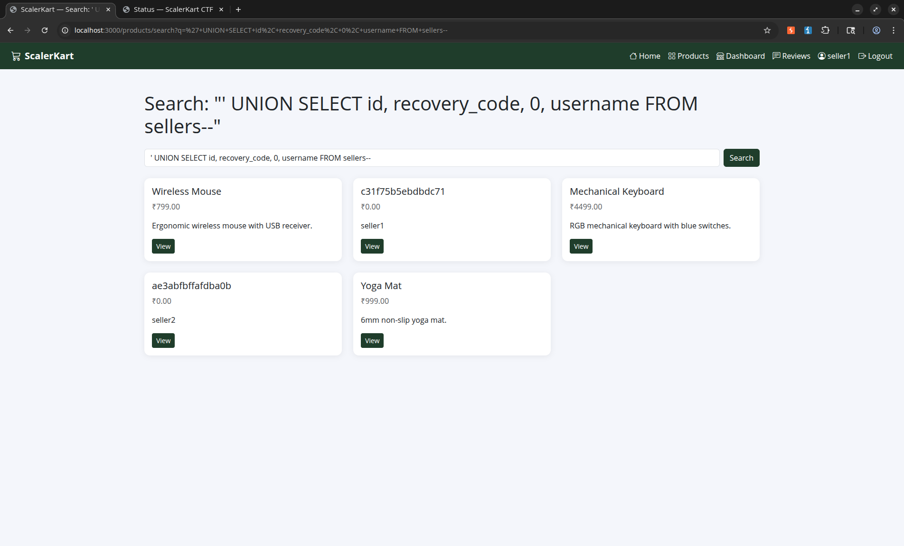
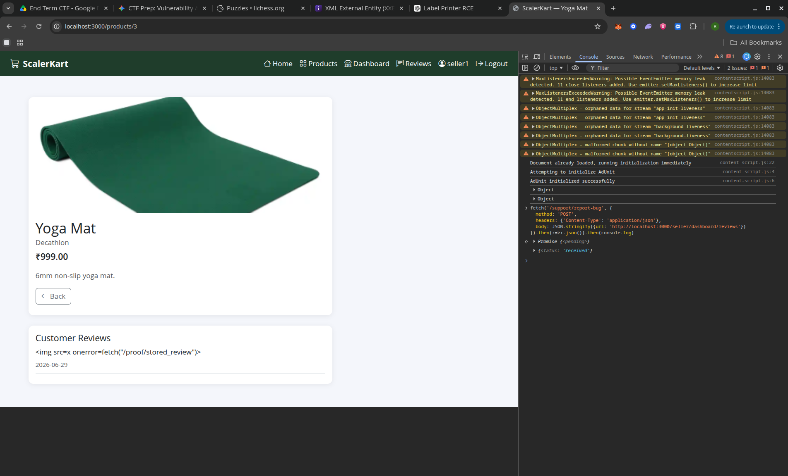
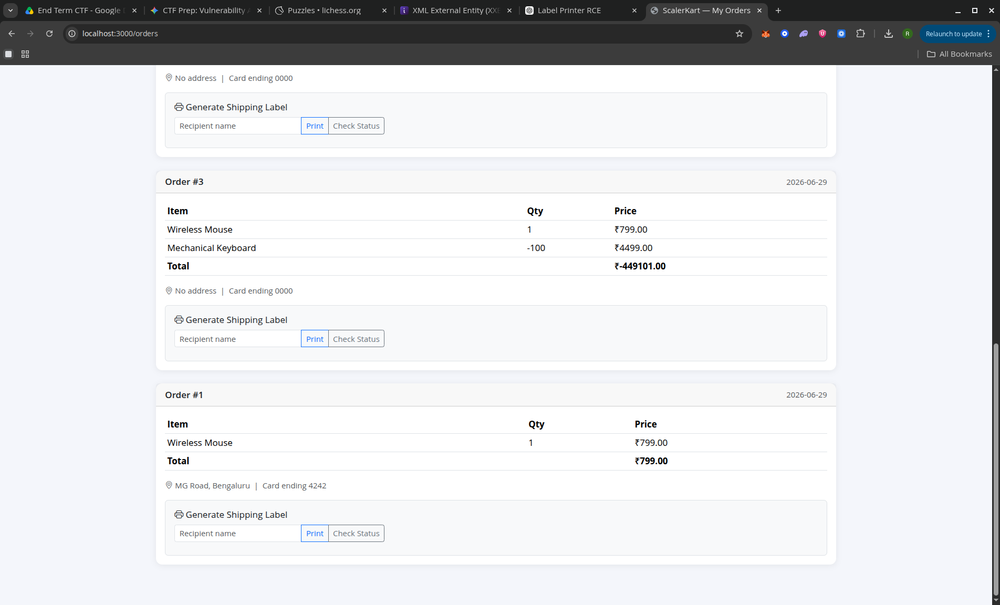

# ScalerKart CTF Technical Writeups


## Challenge #1 — Hidden Inventory

**1. Vulnerability Title:** SQL Injection (UNION-based)

**2. Description:**
The application's product search feature takes user input from the search bar and concatenates it directly into the backend database query without parameterization or sanitization. This allows an attacker to break out of the original `SELECT` statement and append a `UNION SELECT` statement. Because the injected query matches the column structure of the original query, the application reflects sensitive data from other tables (such as seller recovery codes) directly onto the frontend search results UI.

**3. Steps to Reproduce:**

1. Log into the application using a seller account (e.g., `seller1`).
2. Navigate to the Products page.
3. In the search bar, enter the following exact payload to balance the columns and extract data from the `sellers` table:
`' UNION SELECT id, recovery_code, 0, username FROM sellers--`
4. Submit the search query.
5. As demonstrated in **Screenshot_2026-06-29_13-04-01.png**, the search results page will now render the hidden data. The application displays the recovery codes as product titles and the associated usernames as the product descriptions.

**4. Impact:**
This vulnerability completely compromises the confidentiality of the database. An attacker can map the entire database schema and extract highly sensitive information, including user credentials and recovery codes, which can lead to full account takeover.

**5. Remediation:**
The developer must stop concatenating user input directly into SQL strings. The search query should be rewritten using Prepared Statements (Parameterized Queries). This ensures the database treats the search term strictly as string data, neutralizing any injected SQL commands.

**6. CVSS Score:** **6.5 (Medium)**



## Challenge #7 — Review Board

**1. Vulnerability Title:** Stored Cross-Site Scripting (XSS)

**2. Description:**
The application fails to sanitize user-submitted reviews before rendering them on the seller's review dashboard. An attacker can inject malicious HTML and JavaScript. When a victim (such as a seller or an automated bot) visits the review page, the browser interprets the stored payload as executable code, running it within the victim's session context.

**3. Steps to Reproduce:**

1. Submit a review on a product containing a malicious script payload (e.g., using an `onerror` event handler).
2. Use the "Report Bug" feature to submit the URL of the seller’s review dashboard to the automated bot.
3. Once the bot visits the reported URL, the payload executes in the bot's session, potentially exfiltrating data to an attacker-controlled endpoint.

**4. Impact:**
Stored XSS allows an attacker to hijack user sessions, perform unauthorized actions on behalf of the victim, or steal sensitive data by executing scripts within the victim's browser.

**5. Remediation:**
Implement context-aware output encoding. Convert HTML control characters into safe HTML entities before rendering content. Utilize a robust HTML sanitization library to strip dangerous tags and event handlers from user-generated input.

**6. CVSS Score:** **5.4 (Medium)**




## Challenge #11 — Zero Checkout

**1. Vulnerability Title:** Business Logic Flaw (Insufficient Input Validation)

**2. Description:**
The application allows shoppers to add items to their cart, adjust quantities, and check out. However, the backend /cart/update endpoint completely fails to validate if the quantity value is a positive integer. Because the server accepts negative numbers, an attacker can manipulate their cart total to be less than or equal to zero.

**3. Steps to Reproduce:**

Log in as a customer:
```curl -c /tmp/cust.txt -X POST 'http://localhost:3000/login' -d 'username=customer1&password=Customer123!```

Add a product (e.g., product_id 1) to the cart:
```curl -b /tmp/cust.txt -X POST 'http://localhost:3000/cart/update' -H 'Content-Type: application/json' -d '{"product_id":1,"quantity":1}'```

Update the quantity to a negative number:
```curl -b /tmp/cust.txt -X POST 'http://localhost:3000/cart/update' -H 'Content-Type: application/json' -d '{"product_id":1,"quantity":-1}'```

Submit the checkout request:
```curl -b /tmp/cust.txt -X POST 'http://localhost:3000/cart/checkout' -H 'Content-Type: application/json'```

The server successfully processes the order with a total of -799.0 and triggers the flag.

**4. Impact:**
Severe financial loss for the business. Attackers can purchase expensive items for free by offsetting the cart total with negative quantities of other items, or theoretically force the application to owe them money.

**5. Remediation:**
Implement strict server-side validation on the /cart/update endpoint to ensure quantity is always an integer greater than 0. If a value of 0 is submitted, it should trigger a delete/remove function instead.

**6. CVSS Score:** **6.5 (Medium)**




## Challenge #12 — Image Fetch

**1. Vulnerability Title:** Server-Side Request Forgery (SSRF)

**2. Description:**
The application allows sellers to import product images by providing a URL. The backend fetches this URL to process the image. Because the backend does not validate the destination, an attacker can supply an internal loopback address. This forces the server to make requests to its own protected internal endpoints that are otherwise unreachable from the public internet, bypassing access controls.

**3. Steps to Reproduce:**

1. Navigate to the image import feature on the seller dashboard.
2. Provide a URL pointing to an internal-only endpoint (e.g., `[http://127.0.0.1:5000/internal/path](http://127.0.0.1:5000/internal/path)`).
3. The server will execute the request internally, and the result—often an API key or internal data—will be reflected in the response size or content returned to the attacker.

**4. Impact:**
SSRF allows attackers to pivot through the web server to access the internal network. This can lead to the exposure of administrative APIs, cloud instance metadata, and sensitive internal system files.

**5. Remediation:**
Implement strict URL validation via an allow-list of approved domains. If arbitrary fetching is necessary, resolve the URL to an IP address and verify it does not belong to private or loopback ranges before initiating the request.

**6. CVSS Score:** **6.5 (Medium)**
