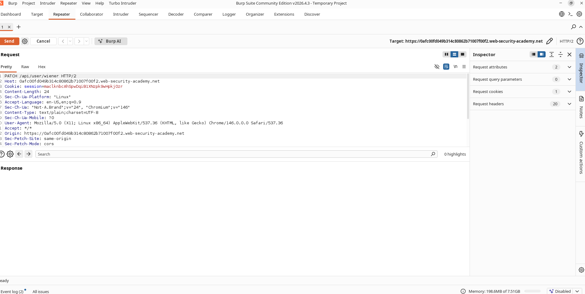
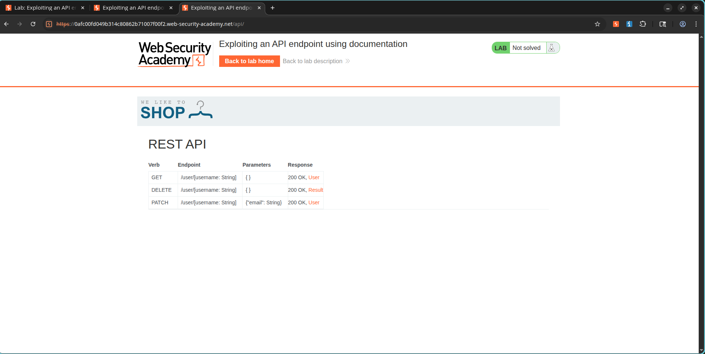

# Abusing Exposed API Documentation to Access Privileged Endpoints

## Lab Information

- **Challenge Name:** Exploiting an API endpoint using documentation
- **Classification:** API Testing
- **Skill Level:** Apprentice
- **Platform:** PortSwigger Web Security Academy

## Objective

Locate publicly accessible API documentation, map the structure of available API endpoints, and utilize the documented features to delete the user account of `carlos`.

---

## Vulnerability Analysis

Web applications frequently publish API documentation to assist with internal development and integrations. When left accessible to the public, this documentation can reveal administrative paths and functions that are vulnerable to exploitation. In this case, an exposed documentation page disclosed a protected endpoint for deleting user accounts without proper restriction.

---

## Exploitation Flow

### Step 1: Capturing an API Request

Log in using the provided user credentials:

```text
Username: wiener
Password: peter
```

Update the profile email address on the account settings page and intercept the outgoing API request.

### Evidence



---

### Step 2: Locating the API Documentation

The captured request was targeted at:

```http
PATCH /api/user/wiener
```

By exploring the route structure and testing alternative paths, the publicly exposed API documentation endpoint was uncovered. This page details available API operations, accepted parameters, and query formats.

### Evidence



---

### Step 3: Triggering the Deletion Function

Reviewing the interactive API specifications revealed the following route:

```http
DELETE /api/user/{username}
```

By submitting a DELETE request with the username parameter set to:

```text
carlos
```

The target account was successfully removed from the system.

---

## Conclusion

Exposed administrative API functionality was accessible directly through public documentation files, permitting the deletion of arbitrary user accounts.

### Evidence


---

## Severity and Impact

Exposed API specifications help attackers by:

- Revealing hidden backend paths.
- Exposing administrative endpoints.
- Showing accepted parameters and request bodies.
- Streamlining route profiling.
- Enabling privilege escalation and unauthorized actions.

---

## Key Takeaways and Mitigations

- Restrict access to API documentation so that it is not publicly reachable.
- Enforce strict authorization checks on all administrative endpoints.
- Never rely on security through obscurity to protect administrative paths.
- Review API endpoint exposures and access controls regularly.

---

## Screenshots Used

```text
images/
1. api_user_request.png
2. api_documentation.png
3. lab_solved.png
```

## Challenge Status

✅ Solved