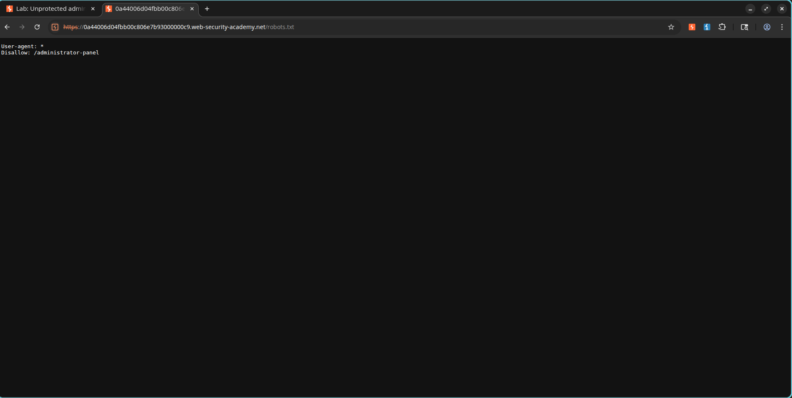
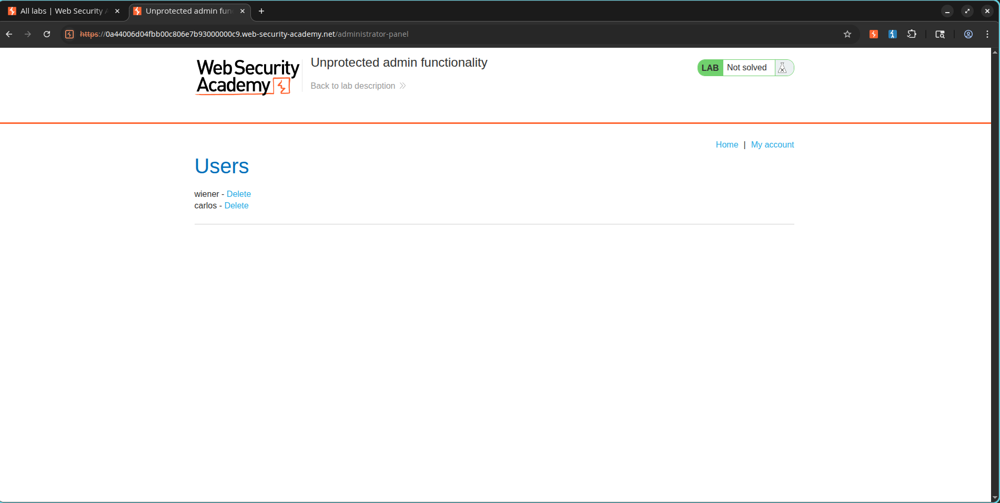
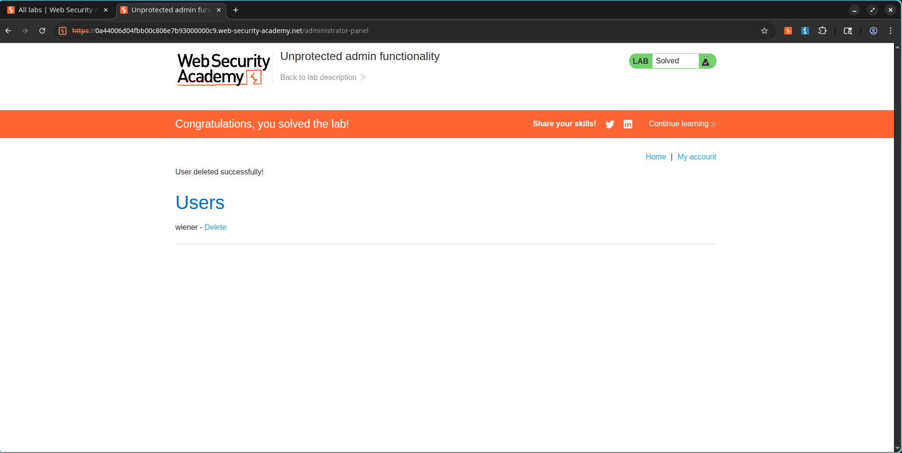

# Exploiting Unrestricted Access to Administrative Endpoints

## Lab Information

* **Classification:** Access Control
* **Skill Level:** Apprentice
* **Challenge Name:** Unprotected Admin Functionality
* **Status:** Resolved

---

## Objective

Gain entry to an unprotected administrative console and delete the user account:

```text
carlos
```

---

## Vulnerability Analysis

The web application exposes administrative interfaces without implementing appropriate role validation or session checks. These sensitive paths are listed in the public `robots.txt` configuration file, which allows any visitor to locate and navigate to the admin console directly.

---

## Exploitation Steps

### 1. Locating the Hidden Console Route

Access the application's robot directives file:

```text
/robots.txt
```

The file reveals the path to the restricted administrative console:

```text
Disallow: /administrator-panel
```

### Screenshot



---

### 2. Accessing the Admin Console

Navigate directly to the discovered URL path:

```text
/administrator-panel
```

The application grants full access to the administration dashboard without requiring an active administrator session.

### Screenshot



---

### 3. Deleting the Target User

On the user administration interface, locate the account details for:

```text
carlos
```

Select the delete button next to the account name to remove it from the system.

---

## Result

The target user was removed and the challenge status was marked as solved.

### Screenshot



---

## Severity and Impact

An attacker exploiting this vulnerability can:

* Access restricted administrative systems.
* Execute privileged functions without authentication.
* Modify, overwrite, or delete backend databases.
* Compromise application security and integrity.

---

## Mitigation and Prevention

* Enforce strict server-side authorization checks on all administrative endpoints.
* Never rely on hidden paths or directory structures for security.
* Control access to administration routes using role-based access control (RBAC).
* Audit public files (such as `robots.txt`) to ensure they do not list restricted paths.

---

## Key Takeaways

* Administrative controllers must validate user permissions on every request.
* The `robots.txt` file is not a security control and should not disclose hidden routes.
* Security through obscurity is ineffective.
* Access validation must happen on the backend, not the client.
