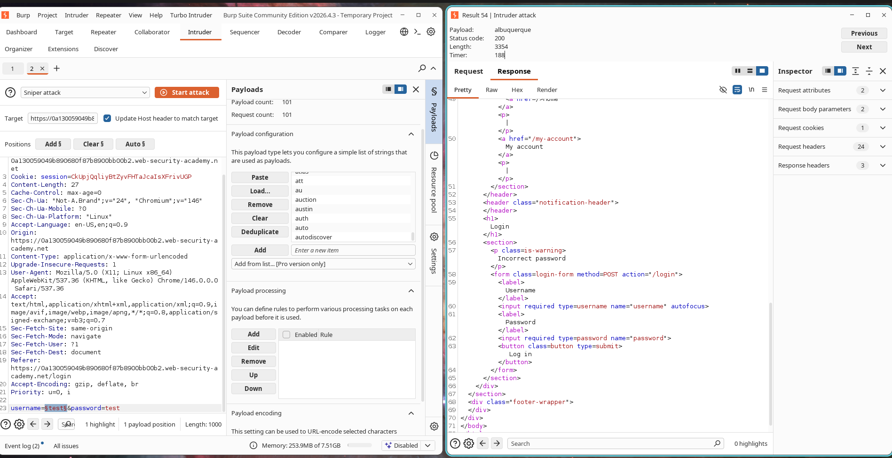
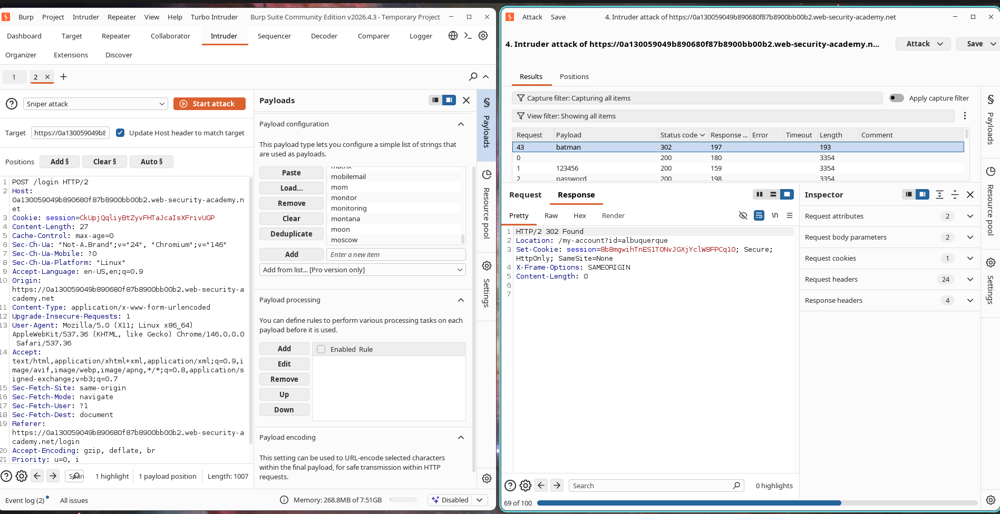

# Enumerating Usernames through Inconsistent HTTP Responses

## Overview

The system is susceptible to username enumeration because of variations in authentication error messages. When attempting to log in, the backend sends distinct responses based on the validity of the submitted username.

Specifically, entering a non-existent username yields:

```text
Invalid username
```

Conversely, entering a valid username alongside an incorrect password yields:

```text
Incorrect password
```

This discrepancy enables an attacker to confirm which usernames exist in the system through simple response profiling. Once a valid username is identified, the threat actor can proceed with a targeted brute-force campaign against that specific account.

---

## Exploitation Steps

### Phase 1: Enumerating Usernames

1. Open the login page.
2. Make a login request containing mock credentials.
3. Intercept this request using Burp Suite.
4. Forward the captured request to Burp Intruder.
5. Configure the payload marker around the `username` parameter.
6. Import the provided list of potential usernames.
7. Run the Intruder attack.
8. Analyze the lengths and contents of the resulting responses.
9. Look for the username that triggers the error:

```text
Incorrect password
```

10. Note down the identified username.

### Phase 2: Brute-forcing the Password

1. Substitute the username parameter with the validated username.
2. Set the payload marker on the `password` parameter.
3. Import the list of potential passwords.
4. Initiate the Intruder attack.
5. Inspect the HTTP response status codes.
6. Spot the password that results in a redirect response:

```text
302 Found
```

7. Record the correct password.

### Phase 3: Account Compromise

1. Return to the application login interface.
2. Log in using the extracted username and password.
3. Confirm access to the user account area.
4. Verify the lab is successfully resolved.

---

## Proof of Concept

### Discovered Username

```text
albuquerque
```

### Discovered Password

```text
batman
```

### Enumeration Indicator

Non-existent accounts returned:

```text
Invalid username
```

Existing account returned:

```text
Incorrect password
```

### Successful Login Indicator

The authentication request generated a redirect response:

```http
HTTP/2 302 Found
Location: /my-account?id=albuquerque
```

---

## Screenshots

### Screenshot 1 – Enumerating Usernames

**Description:**

Burp Intruder attack against the list of candidate usernames. The response for `albuquerque` is distinct from the others and contains the message:

```text
Incorrect password
```

This difference confirms that this username exists in the system.



---

### Screenshot 2 – Brute-forcing the Password

**Description:**

Burp Intruder attack against candidate passwords for the confirmed username. The password `batman` produced a `302 Found` redirect, signifying a successful login.



---

### Screenshot 3 – Account Access

**Description:**

Logging in successfully with the extracted credentials and completing the PortSwigger lab.


---

## Severity and Impact

* Disclosure of existing user identities.
* Facilitates focused password brute-force campaigns.
* Lowers the complexity required to breach accounts.
* Elevates the risk of full account takeovers.
* Exposes private user data.
* May lead to administrative account compromise and subsequent privilege escalation.

---

## Mitigation Guidelines

1. Configure generic, identical error messages for all failed login attempts.

Example:

```text
Invalid username or password
```

2. Implement account lockout mechanisms after a predefined number of failed authentication attempts.
3. Enforce robust password requirements.
4. Implement Multi-Factor Authentication (MFA).
5. Deploy rate limiting on authentication endpoints.
6. Track and alert on abnormal authentication patterns.
7. Integrate CAPTCHA verification where appropriate.

---

## CVSS Risk Rating

**CVSS v3.1 Score:** 5.3 (Medium)

### Vector

```text
CVSS:3.1/AV:N/AC:L/PR:N/UI:N/S:U/C:L/I:N/A:N
```

---

## CVSS Scoring Justification

### Attack Vector

Network (N) – Exploitation can be carried out remotely over HTTP.

### Attack Complexity

Low (L) – The attack does not require specialized conditions.

### Privileges Required

None (N) – No active credentials are required to initiate the attack.

### User Interaction

None (N) – The attack runs autonomously without user interaction.

### Scope

Unchanged (U) – The impact is isolated to the vulnerable application.

### Confidentiality Impact

Low (L) – Discloses valid user handles.

### Integrity Impact

None (N) – The attack does not modify system data.

### Availability Impact

None (N) – System performance and availability are unaffected.

---

## External References

* OWASP Authentication Cheat Sheet
* OWASP Credential Stuffing Prevention Cheat Sheet
* PortSwigger Web Security Academy – Username Enumeration via Different Responses
