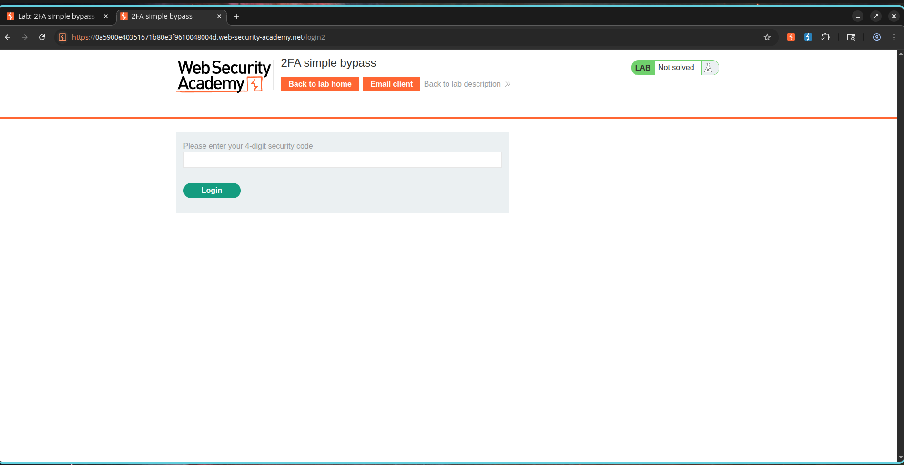
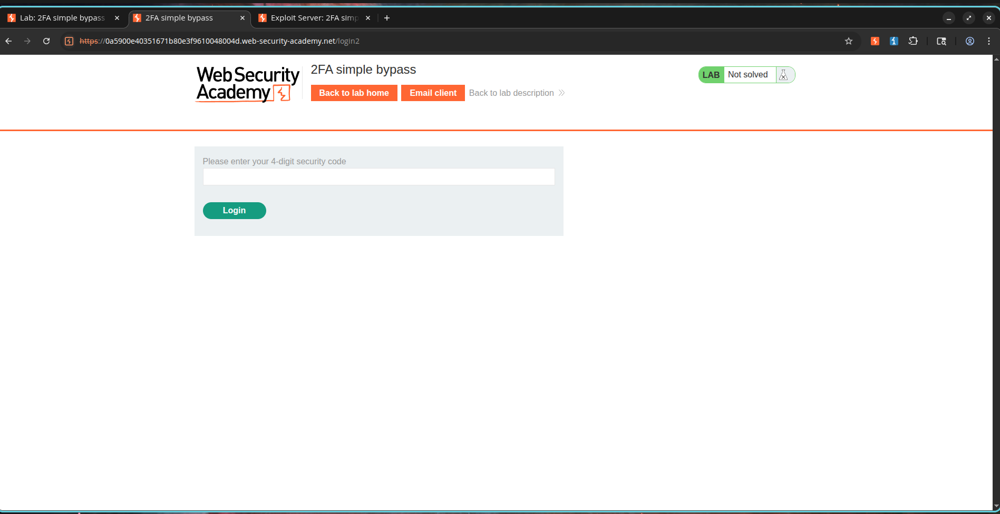

# Bypassing Two-Factor Authentication via Direct Request Manipulation

## Overview

The web application uses two-factor authentication (2FA) as a secondary validation step after a user enters their primary credentials. Nonetheless, the access control system fails to verify whether the 2FA step has been completed before serving authenticated pages.

Upon entering correct primary credentials, the application forwards the user to a page requesting a 2FA verification code. However, by navigating directly to the `/my-account` page URL, an attacker can bypass this second authentication step entirely. This flaw compromises the security provided by multi-factor authentication, allowing anyone with correct primary credentials to access accounts without passing the second verification factor.

---

## Exploitation Steps

### Phase 1: Observing the Standard Authentication Flow

1. Navigate to the application login interface.
2. Log in using valid user credentials:

```text
Username: wiener
Password: peter
```

3. Observe the redirect to the 2FA verification interface.
4. Retrieve the verification code from the email client.
5. Enter the code to access the account dashboard page.

---

### Phase 2: Bypassing the 2FA Check

1. Sign out of the session.
2. Log in using the victim's credentials:

```text
Username: carlos
Password: montoya
```

3. Observe the redirect to the 2FA validation page.
4. Do not submit a code.
5. Edit the URL directly in the browser address bar, changing:

```text
/login2
```

to:

```text
/my-account
```

6. Press Enter to request the new URL.
7. Confirm that the application grants full access to the victim's dashboard without verifying the 2FA code.

---

## Proof of Concept

### Target Credentials

```text
Username: carlos
Password: montoya
```

### Intended Authentication Flow

```text
Primary Login
      ↓
2FA Code Request
      ↓
Dashboard Access
```

### Exploited Vulnerable Flow

```text
Primary Login
      ↓
2FA Code Request
      ↓
Direct Navigation to /my-account
      ↓
Access Granted (2FA Bypassed)
```

### Vulnerable Resource

```http
GET /my-account HTTP/2
```

The server displays the resource without verifying that the session has completed the second authentication factor.

---

## Screenshots

### Screenshot 1 – Standard 2FA Verification Page

**Description:**

Upon successful verification of primary credentials, the system redirects the client to the 2FA prompt to enter a security code.



---

### Screenshot 2 – Victim 2FA Prompt

**Description:**

Log in attempt with the victim account (`carlos`) redirected to the 2FA prompt.



---

### Screenshot 3 – Successful 2FA Bypass

**Description:**

Gaining access to the victim's account dashboard page simply by typing the account URL, bypassing the 2FA code verification.


---

## Severity and Impact

* Complete bypass of multi-factor authentication controls.
* Unauthorized access to user profiles.
* Heightened risk of full account takeovers.
* Nullification of secondary authentication controls.
* Exposure of sensitive user information.
* Potential privilege escalation if administrative accounts are accessed.

---

## Mitigation and Prevention

1. Validate the completion status of the 2FA step on the server side before rendering protected pages.
2. Require validation of the second factor prior to initiating an authenticated session.
3. Manage the authentication state securely using server-side session variables.
4. Block direct access to inner routes until the 2FA phase is marked complete.
5. Centralize access control checks across all authenticated endpoints.
6. Conduct regular authentication workflow reviews and security assessments.

---

## CVSS Rating

**CVSS v3.1 Score:** 8.1 (High)

### Vector

```text
CVSS:3.1/AV:N/AC:L/PR:N/UI:N/S:U/C:H/I:H/A:N
```

---

## CVSS Calculation Rationale

### Attack Vector

Network (N) – The vulnerability is exploitable remotely over HTTP.

### Attack Complexity

Low (L) – The bypass only requires manual URL manipulation in a browser.

### Privileges Required

None (N) – The attacker only needs primary credentials, which are assumed compromised.

### User Interaction

None (N) – The attack does not require interaction from the victim.

### Scope

Unchanged (U) – The impact is limited to the application environment.

### Confidentiality Impact

High (H) – Provides access to sensitive account information.

### Integrity Impact

High (H) – Allows unauthorized modifications and actions within the victim's account.

### Availability Impact

None (N) – The exploit has no effect on system availability.

---

## External References

* OWASP Multifactor Authentication Cheat Sheet
* OWASP Authentication Cheat Sheet
* PortSwigger Web Security Academy – 2FA Simple Bypass
