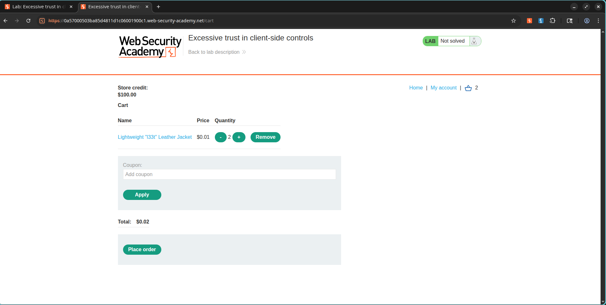
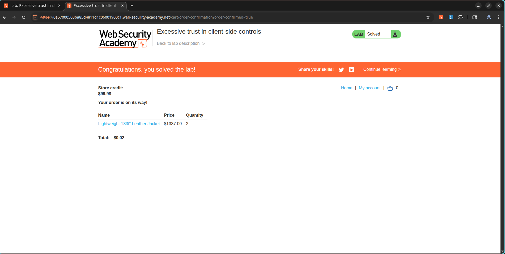

# Lab: Over-Reliance on Client-Side Controls

## Lab Information

**Classification:** Business Logic Vulnerabilities  
**Skill Level:** Apprentice  
**Lab URL:** https://portswigger.net/web-security/logic-flaws/examples/lab-logic-flaws-excessive-trust-in-client-side-controls

---

## Objective

Leverage a business logic vulnerability within the checkout process to purchase the **"Lightweight l33t leather jacket"** at an arbitrary, manipulated price by altering client-side request data.

---

## Vulnerability Analysis

When items are added to the shopping cart, the web application relies entirely on the price value provided directly by the client. The system fails to validate or re-compute the item's cost on the server side, choosing instead to trust the user-supplied input. This makes it possible for an attacker to modify the product price to any arbitrary value during the request phase.

---

## Exploitation Walkthrough

### 1. Authentication

Log in to the online store using the following credentials:

```text
Username: wiener
Password: peter
```

Access the store catalog page.

---

### 2. Selecting the Target Product

Navigate to the details page of the target item:

```text
Lightweight l33t leather jacket
```

Click the following button:

```text
Add to Cart
```

Capture the outgoing request using Burp Suite.

---

### 3. Analyzing the Vulnerable Parameters

Within Burp Suite, navigate to:

```text
Proxy → HTTP History
```

Locate the target request:

```http
POST /cart
```

The body of the request will look similar to this:

```http
productId=1&redir=PRODUCT&quantity=1&price=133700
```

This request structure reveals that the client is transmitting a price parameter directly to the server.

### Screenshot


---

### 4. Relaying to Burp Repeater

Right-click the intercepted request and select:

```text
Send to Repeater
```

---

### 5. Price Modification

Change the price parameter value:

```text
price=133700
```

to:

```text
price=1
```

The modified request body should now be:

```http
productId=1&redir=PRODUCT&quantity=1&price=1
```

Transmit the request. The backend server accepts the altered pricing value without performing verification.

### Screenshot


---

### 6. Confirming Cart Modification

Return to your browser and refresh the shopping cart page. The price of the jacket will now be set to the modified value:

```text
$0.01
```

### Screenshot



---

### 7. Executing the Transaction

With the price now significantly lower than the account's available store credit, finalize the checkout process.

Select:

```text
Place Order
```

The transaction will complete successfully.

---


### 8. Confirming Lab Resolution

After the purchase is successfully executed, the application marks the lab challenge as solved.

### Screenshot



---

## Root Cause Analysis

The application trusts a parameter supplied directly by the client:

```http
price
```

to determine the amount billed during the checkout process. Because the server does not verify the authenticity of the price parameter or calculate the cost independently from a secure database, users can modify the request to purchase products for any amount.

---

## Security Impact

An attacker exploiting this vulnerability can:

- Purchase high-value goods at nominal or customized prices.
- Bypass checkout pricing controls and payment workflows.
- Cause direct financial loss to the vendor.
- Manipulate financial transaction values.
- Abuse logic flows for unauthorized personal gain.

---

## Mitigation and Prevention

1. Never trust pricing parameters transmitted directly by the client.
2. Calculate and verify item costs exclusively on the backend.
3. Ignore or strip out client-supplied pricing parameters from cart update requests.
4. Verify total order prices before finalizing payment transactions.
5. Implement backend integrity checks for all transactional values.

---

## Key Takeaways

Security mechanisms implemented solely on the client side are easily bypassed. Sensitive variables—including product prices, discounts, account balances, and access privileges—must always be verified and enforced by the server.