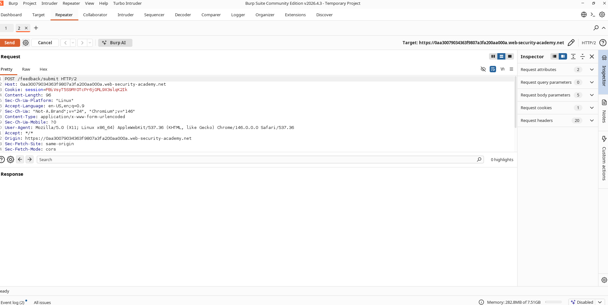

# Timing-Based Verification of Blind OS Command Injection

## Lab Information

- **Challenge Name:** Blind OS Command Injection with Time Delays
- **Classification:** OS Command Injection
- **Skill Level:** Practitioner
- **Status:** Resolved

## Objective

Exploit a blind OS command injection vulnerability located in the feedback submission form. Since the output of the executed commands is not returned in the response, we must verify execution by causing a measurable time delay on the backend.

---

## Vulnerability Analysis

The feedback submission form incorporates user inputs directly into system commands without executing sanitization. Because the query's output is omitted from HTTP responses, we confirm the exploit via side-channel effects—specifically, a prolonged server response time.

---

## Exploitation Steps

1. Navigate to the feedback submission interface.
2. Submit a standard form entry while capturing the request in Burp Suite.
3. Forward the captured request to Burp Repeater.
4. Append a command that forces a time delay to the `email` parameter.
5. Submit the modified request.
6. Verify that the server takes roughly 10 seconds longer to respond than normal.
7. This delay confirms that the command was successfully processed by the system.

---

## Payload Used

```text
x||ping+-c+10+127.0.0.1||
```

---

## Explanation

The injected payload executes the following command:

```bash
ping -c 10 127.0.0.1
```

This instruction forces the host to send 10 echo requests, which takes approximately 10 seconds to complete. The server remains blocked during this execution. By measuring this delay, we can confirm command execution even without direct output display.

---

## Result

The server response was delayed by approximately 10 seconds, verifying the vulnerability. The challenge is marked as solved.

---

## Screenshots

### Original Feedback Request



### Time Delay Observed


### Lab Solved


---

## Impact Assessment

Blind OS command injection allows attackers to:

* Execute arbitrary commands on the backend server.
* Disclose sensitive system files.
* Establish persistent shells.
* Escalate system privileges.
* Compromise the host system.

Even when direct command output is hidden, timing-based payloads allow attackers to verify execution and extract data.

---

## Mitigation and Remediation

* Avoid passing user-controlled parameters directly to OS shell execution interfaces.
* Implement native programming API utilities instead of executing shell scripts.
* Validate and sanitize all client-submitted fields.
* Configure strict allowlist checks.
* Run web services under low-privileged accounts.
* Monitor backend request processing times for unusual latency spikes.

---

## Summary Takeaway

Blind command injection vulnerabilities remain highly critical despite the lack of visible output. Attackers can rely on timing-based side-channel responses to verify command execution and exploit the host.
