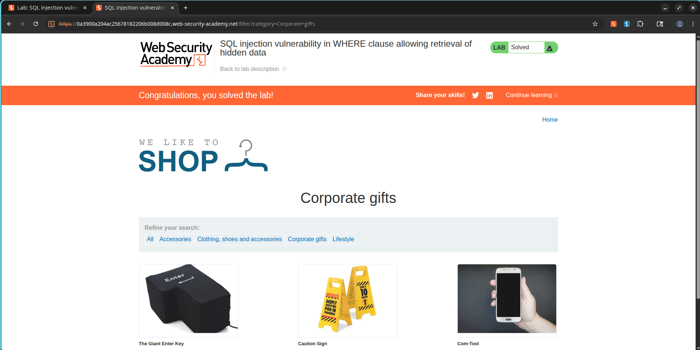

# Bypassing Category Restrictions via SQL Injection in Product Filters

## Overview

The product catalog's category filtering logic is vulnerable to SQL Injection. This issue arises because the application directly embeds user-provided inputs into backend database queries without executing sufficient validation or utilizing parameterization.

The database executes a query patterned as follows:

```sql
SELECT * FROM products WHERE category = 'Gifts' AND released = 1;
```

By injecting custom SQL sequences into the category filter, an attacker can modify the query's logical structure to display items that are normally hidden from public view, such as restricted or unreleased merchandise.

---

## Exploitation Steps

1. Navigate to the store's product catalog.
2. Choose any of the available product categories.
3. Intercept the resulting HTTP request using Burp Suite.
4. Forward this request to Burp Repeater.
5. Identify the `category` request parameter.
6. Change the parameter's value to:

```sql
' OR 1=1--
```

7. Submit the modified request.
8. Verify that the response includes products from all categories, including those that are normally hidden.

---

## Proof of Concept

### Payload

```sql
' OR 1=1--
```

### Intended Database Query

```sql
SELECT * FROM products
WHERE category = 'Gifts'
AND released = 1;
```

### Injected Database Query

```sql
SELECT * FROM products
WHERE category = ''
OR 1=1--'
AND released = 1;
```

The injected logic (`OR 1=1`) forces the query constraints to evaluate as true for every single row in the target table. The comment indicator (`--`) instructs the database engine to ignore the remainder of the query, bypassing the `released = 1` condition.

---

## Screenshots

### Screenshot 1 - Burp Suite Request and Response

**Purpose:** Demonstrates successful SQL Injection exploitation.

**Take Screenshot When:**

* The modified request containing `' OR 1=1--` is visible in Burp Repeater.
* The response shows products from multiple categories.

**Insert Screenshot Below**


---

### Screenshot 2 - Lab Solved Confirmation

**Purpose:** Demonstrates successful completion of the PortSwigger lab.

**Take Screenshot When:**

* The page displays:
  `Congratulations, you solved the lab!`

**Insert Screenshot Below**



---

## Severity and Impact

* Unauthorized access to restricted product listings.
* Disclosure of unreleased item information.
* Leakage of sensitive operational data.
* Expanded attack surface for more intrusive SQL injection payloads.
* Loss of confidentiality within the application database.

---

## Mitigation Guidelines

1. Leverage parameterized queries (prepared statements) for all database transactions.
2. Clean and validate all incoming client data.
3. Set up server-side input verification rules.
4. Restrict database account permissions using the principle of least privilege.
5. Perform periodic code audits and security tests.

---

## CVSS Rating

**CVSS v3.1 Score:** 5.3 (Medium)

**Vector:**

```text
CVSS:3.1/AV:N/AC:L/PR:N/UI:N/S:U/C:L/I:N/A:N
```

---

## CVSS Scoring Justification

### Attack Vector

Network (N) – Exploitation is carried out remotely over HTTP.

### Attack Complexity

Low (L) – No special conditions or complex configurations are required.

### Privileges Required

None (N) – The endpoint can be accessed by unauthenticated users.

### User Interaction

None (N) – The exploit does not require victim interaction.

### Scope

Unchanged (U) – The impact is isolated to the web application's database.

### Confidentiality Impact

Low (L) – Provides access to hidden product catalog details.

### Integrity Impact

None (N) – No database modification or write actions occur.

### Availability Impact

None (N) – The database service remains available and functional.

---

## References

* OWASP SQL Injection Prevention Cheat Sheet
* PortSwigger Web Security Academy – SQL Injection Vulnerability Allowing Login Bypass
