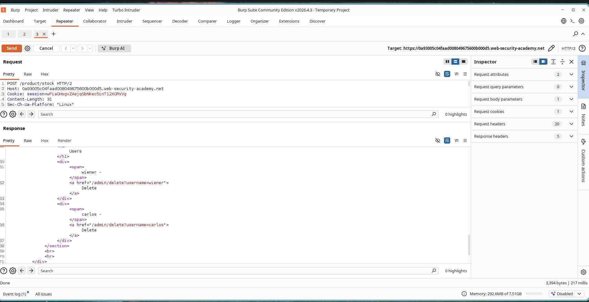
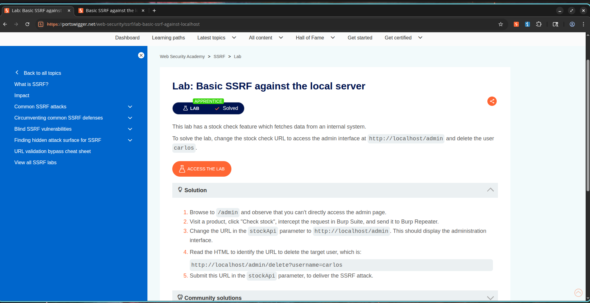

# Exploiting Loopback SSRF in Stock Check Functionality

## Lab Information

* **Classification:** Server-Side Request Forgery (SSRF)
* **Challenge Name:** Basic SSRF Against the Local Server
* **Skill Level:** Apprentice
* **Status:** Resolved

---

## Objective

The web application uses user-supplied URLs to fetch inventory status from an internal system. The goal is to exploit this SSRF vulnerability to access the local admin interface and delete the user account:

```text
carlos
```

---

## Vulnerability Analysis

Server-Side Request Forgery (SSRF) happens when a server-side application retrieves remote assets using client-controlled URLs without executing sufficient validation. This enables an attacker to force the server to connect to internal services, local addresses, or cloud metadata services, bypassing firewalls and network segmentation.

In this lab, the stock checking routine permits custom URL paths to be supplied through the `stockApi` parameter.

---

## Exploitation Steps

### Step 1 - Capturing the Stock Query Request

1. Navigate to a product detail page.
2. Click the **Check Stock** button.
3. Capture the outgoing HTTP request using Burp Suite.
4. Forward the captured request to Burp Repeater.

The vulnerable parameter value appears as:

```http
stockApi=http://stock.weliketoshop.net:8080/product/stock/check?productId=1&storeId=1
```

### Screenshot


---

### Step 2 - Accessing the Internal Administration Console

Modify the `stockApi` parameter value to target the loopback admin interface:

```http
stockApi=http://localhost/admin
```

Submit the request. The response returns the HTML of the local administration panel, disclosing the URL path for user deletion:

```html
/admin/delete?username=carlos
```

### Screenshot



---

### Step 3 - Removing Carlos via SSRF

Modify the request parameter again, appending the user deletion path:

```http
stockApi=http://localhost/admin/delete?username=carlos
```

Submit the request. The web server issues this request internally and deletes the target user account.

---


### Step 4 - Confirming Challenge Completion

After the deletion request executes, the challenge is successfully completed.

### Screenshot



---

## Severity and Impact

Successful exploitation of SSRF vulnerabilities can allow attackers to:

* Access internal administration interfaces.
* Interact with services running on localhost.
* Bypass firewall restrictions.
* Access cloud metadata services.
* Extract sensitive information.
* Perform privilege escalation.

In production environments, SSRF vulnerabilities frequently lead to full infrastructure compromise.

---

## Mitigation and Prevention

To prevent SSRF vulnerabilities:

1. Implement strict allowlists for outbound requests.
2. Block access to localhost and private IP ranges.
3. Restrict access to internal administration panels.
4. Validate and sanitize user-supplied URLs.
5. Use network segmentation.
6. Disable unnecessary outbound connections.

---

## Summary

The stock-check functionality trusted user-controlled URLs without validation. By modifying the `stockApi` parameter, we forced the application to access an internal administration panel and execute privileged actions, successfully exploiting the SSRF vulnerability.
