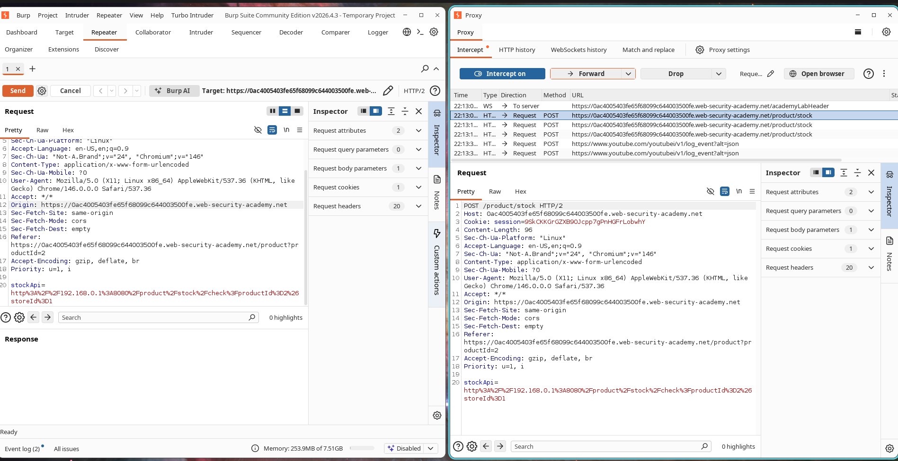
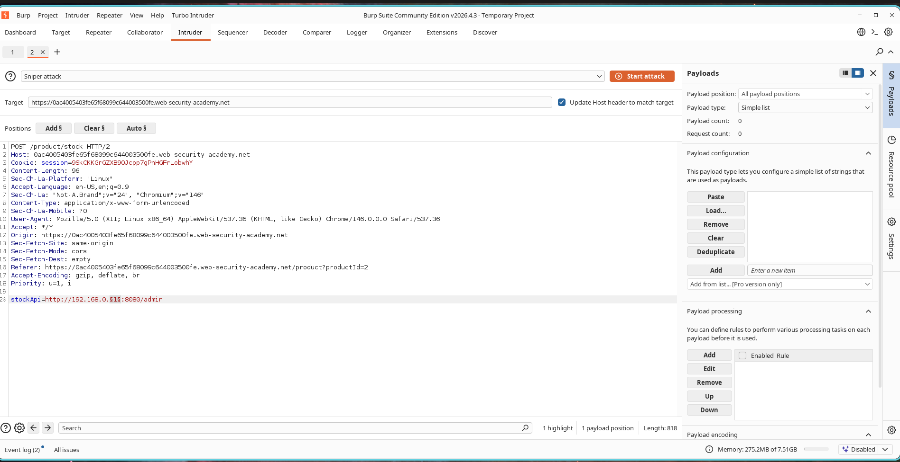
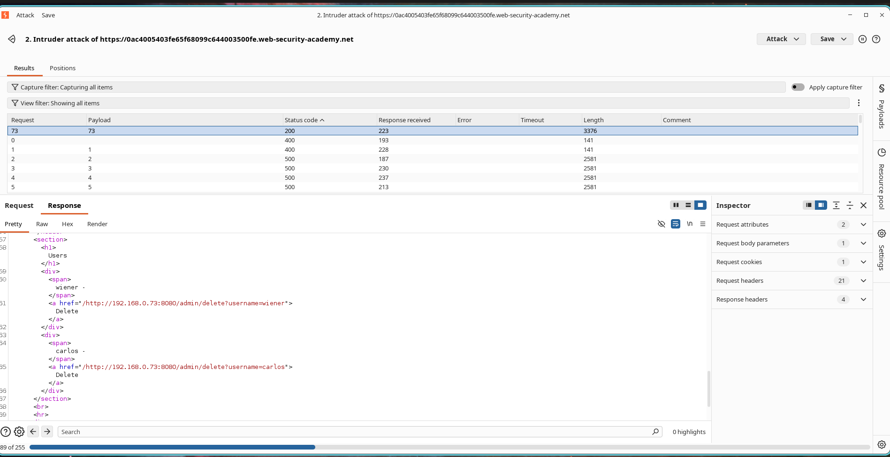
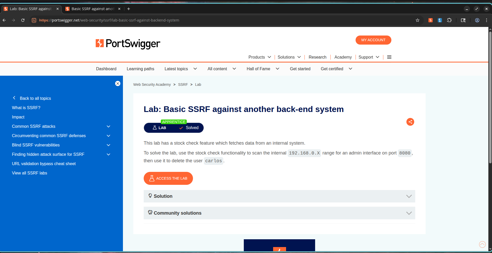

# Scanning Internal Subnets via Server-Side Request Forgery (SSRF)

## Lab Information

* **Classification:** Server-Side Request Forgery (SSRF)
* **Challenge Name:** Basic SSRF Against Another Back-End System
* **Skill Level:** Apprentice
* **Status:** Resolved

---

## Objective

The application's stock checker retrieves data from an internal service. The objective is to leverage this SSRF vulnerability to scan the private network subnet, identify an active administrator interface on the `192.168.0.X` IP range, and use it to delete the user:

```text
carlos
```

---

## Vulnerability Analysis

Server-Side Request Forgery (SSRF) occurs when a web server makes outbound connections to user-specified URLs. This allows attackers to map internal systems, interact with non-public backend services, perform subnet scanning, and access private administrative resources. In this case, we manipulate the `stockApi` parameter to probe internal IP addresses.

---

## Exploitation Steps

### Step 1 - Intercepting the Stock Request

1. Navigate to a product page.
2. Select the **Check Stock** button.
3. Capture the request using Burp Suite and forward it to Burp Intruder.

The original parameter is structured as:

```http
stockApi=http://stock.weliketoshop.net:8080/product/stock/check?productId=1&storeId=1
```

### Screenshot



---

### Step 2 - Setting Up the Subnet Scan

Modify the URL to target the internal range:

```http
stockApi=http://192.168.0.1:8080/admin
```

Place a payload marker on the last octet of the IP address (`1`) and configure Burp Intruder to iterate through numbers from:

```text
1 - 255
```

using the **Numbers** payload type settings.

### Screenshot



---

### Step 3 - Finding the Administrative Host

Execute the Intruder attack and evaluate the HTTP responses.

While most IP addresses return error codes, one host returns a successful status code, indicating the admin panel path is active. This response exposes the user management interface.

### Screenshot



---

### Step 4 - Deleting the Carlos Account

Using the discovered host IP, construct the final user deletion URL path:

```http
/admin/delete?username=carlos
```

Submit the request. The server makes the call internally and deletes the account.

---

### Step 5 - Verifying Challenge Completion

After the user account is deleted, the lab is marked as solved.

### Screenshot



---

## Severity and Impact

Successful SSRF vulnerabilities can allow attackers to:

* Scan internal network ranges.
* Access restricted administrative controls.
* Bypass firewall rules.
* Interact with local backend systems.
* Escalate privileges.
* Query cloud metadata endpoints.

In real-world environments, SSRF is a powerful pivot point for full network compromise.

---

## Mitigation and Prevention

To mitigate SSRF vulnerabilities:

1. Implement strict allowlists for outbound server connections.
2. Block access to local loops and RFC 1918 private subnets.
3. Restrict administrative endpoints.
4. Validate and filter incoming URL structures.
5. Use network-level segmentation controls.
6. Monitor and log all outbound connections.

---

## Summary

The stock-check functionality trusted user-controlled URLs without sufficient validation. By manipulating the `stockApi` parameter, we conducted internal network scanning, discovered the hidden administrative host, and successfully executed the deletion command.
