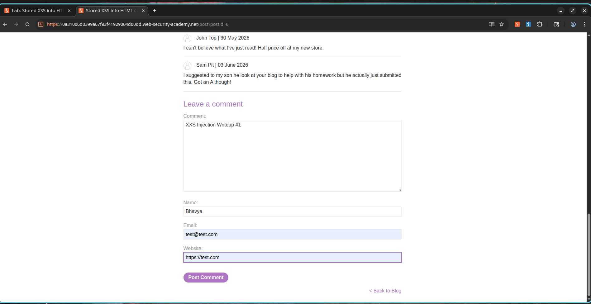
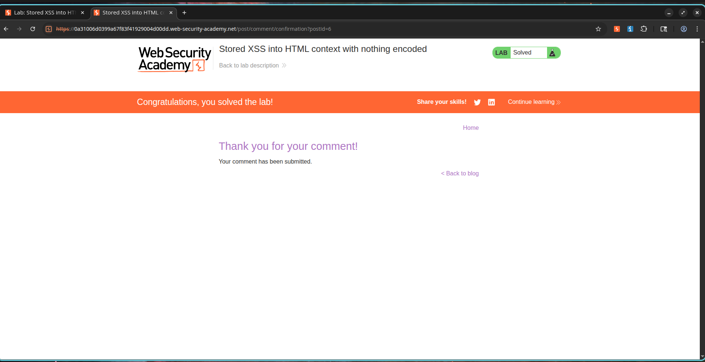

# Stored Cross-Site Scripting (XSS) in Comment Processing

## Overview

The application's blog comment system contains a Stored Cross-Site Scripting (Stored XSS) vulnerability. User input submitted to the comment form is stored persistently on the database server and subsequently rendered on the post page without undergoing validation, filtration, or HTML output encoding.

Since the payload is saved permanently in the backend database, every visitor who views the blog post page will execute the injected script within their browser. Unlike Reflected XSS, this exploit does not depend on tricking a user into clicking a customized link; the script triggers automatically whenever the page containing the comment is loaded.

---

## Exploitation Steps

1. Go to any blog post page.
2. Scroll down to the comment section.
3. Insert the test script payload into the comment field:

```html
<script>alert(1)</script>
```

4. Enter mock data in the remaining fields:

```text
Name: Bhavya
Email: test@test.com
Website: https://test.com
```

5. Submit the comment form.
6. Verify that the application records the payload in the database.
7. Reload the blog post page.
8. Confirm that the comment is rendered raw without output encoding.
9. Verify that the browser executes the script, launching the alert dialog.
10. Confirm that the lab is solved.

---

## Proof of Concept

### Payload

```html
<script>alert(1)</script>
```

### Vulnerable Workflow

```text
User Input Submission
         ↓
Saved in Database
         ↓
Rendered in Blog Comments
         ↓
JavaScript Execution
```

### Stored Response Output

```html
<div class="comment">
<script>alert(1)</script>
</div>
```

### Execution Outcome

```javascript
alert(1)
```

The browser parses the stored database entry as executable code because the application outputs user-generated content directly into the DOM without HTML entity encoding.

---

## Screenshots

### Screenshot 1 – Malicious Payload Submission

**Description:**

The attacker submits a blog comment containing a malicious script tag. The backend accepts and stores the input without validation.



---

### Screenshot 2 – Lab Successfully Solved

**Description:**

After the stored payload executes when the page is viewed, PortSwigger registers the Stored XSS vulnerability as resolved.



---

## Severity and Impact

* Persistent execution of attacker-controlled scripts.
* Session hijacking through cookie extraction.
* Phishing attacks and credential harvesting.
* Page defacement and content manipulation.
* Unauthorized actions performed on behalf of authenticated users.
* Potential compromise of administrative accounts.
* Impact scales to affect every visitor who loads the comments section.

---

## Mitigation Strategies

1. Enforce contextual output encoding on all user-provided data.
2. Sanitize and filter HTML tags before database storage or page rendering.
3. Implement strict server-side validation.
4. Deploy a robust Content Security Policy (CSP).
5. Rely on secure template layouts with automatic escaping features.
6. Conduct security assessments on all endpoints where user inputs are rendered.

---

## CVSS Rating

**CVSS v3.1 Score:** 8.2 (High)

### Vector

```text
CVSS:3.1/AV:N/AC:L/PR:N/UI:R/S:C/C:H/I:L/A:N
```

---

## CVSS Rating Justification

### Attack Vector

Network (N) – The exploit is triggered remotely by visiting a web page.

### Attack Complexity

Low (L) – Execution requires no special conditions or timing variables.

### Privileges Required

None (N) – The comment interface is publicly accessible.

### User Interaction

Required (R) – A victim must view the page containing the comment.

### Scope

Changed (C) – The script executes inside the client-side browser context of other users.

### Confidentiality Impact

High (H) – Allows the extraction of session identifiers and sensitive details.

### Integrity Impact

Low (L) – The script can modify the webpage layout and input fields.

### Availability Impact

None (N) – The vulnerability does not affect service availability.

---

## External References

* OWASP Cross Site Scripting Prevention Cheat Sheet
* OWASP XSS Filter Evasion Cheat Sheet
* PortSwigger Web Security Academy – Stored XSS into HTML Context with Nothing Encoded
